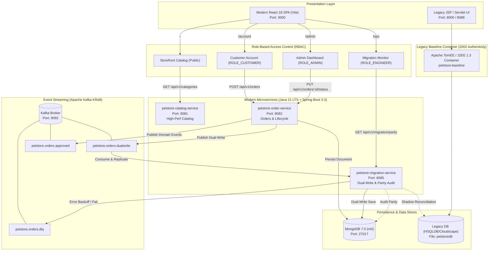

# Java Pet Store 1.3.1_02 Modernization Platform

[](https://openjdk.org/projects/jdk/21/)
[](https://spring.io/projects/spring-boot)
[](https://www.mongodb.com/)
[](https://kafka.apache.org/)
[](https://react.dev/)
[](https://www.typescriptlang.org/)
[](https://vitejs.dev/)

An enterprise-grade, non-destructive architectural modernization of the iconic **Sun Microsystems Java Pet Store (v1.3.1_02, circa 2002)** into a high-throughput, event-driven reactive microservices platform.

---

## Table of Contents
1. [Executive Summary & Architectural Philosophy](#executive-summary--architectural-philosophy)
2. [Target System Architecture](#target-system-architecture)
3. [Component Directory & Port Mapping](#component-directory--port-mapping)
4. [Route-Packaged Architecture & RBAC](#route-packaged-architecture--rbac)
5. [Prerequisites](#prerequisites)
6. [Quickstart Guide](#quickstart-guide)
7. [Verification & Interview Playback Suites](#verification--interview-playback-suites)
8. [Chaos Engineering & Resiliency Demonstration](#chaos-engineering--resiliency-demonstration)
9. [Automated Tests & Code Quality Standards](#automated-tests--code-quality-standards)
10. [Legacy Baseline Preservation Notice](#legacy-baseline-preservation-notice)

---

## Executive Summary & Architectural Philosophy

The goal of this initiative is to demonstrate an end-to-end migration of a legacy monolithic enterprise application utilizing the **Strangler Fig Application Pattern**, ensuring:
- **Zero Modifications to Legacy Code**: All original code in `src/`, `build.xml`, and `setup.sh` remains 100% untouched and preserved.
- **Dual-Write Synchronization**: Live customer write events are asynchronously captured and mirrored to the modern datastore via Kafka.
- **Fault-Isolated Dead-Letter Queues (DLQ)**: Complete fault decoupling—failures in the secondary datastore never impact primary application availability.
- **Automated Shadow Reconciliation**: Continuous, non-blocking background audits comparing legacy RDBMS records with modern MongoDB documents to guarantee 100% data parity.
- **Route-Packaged Modern UI**: A cohesive React 18 + Vite SPA using standard path packages (`/`, `/account`, `/admin`, `/ops`) backed by Role-Based Access Control (RBAC).

---

## Target System Architecture



---

## Component Directory & Port Mapping

| Service / Component | Technology Stack | Port | Purpose |
| :--- | :--- | :--- | :--- |
| **`petstore-frontend`** | React 18, Vite, TypeScript, Tailwind | `3000` | Modern Single-Page Application (Storefront, Account, Admin, Ops) |
| **`petstore-catalog-service`** | Spring Boot 3.3, Java 21, Spring Data Mongo | `8081` | Microsecond catalog queries, multi-lingual pet metadata |
| **`petstore-order-service`** | Spring Boot 3.3, Java 21, Spring Kafka, Mongo | `8082` | Order placement, state transitions, domain events |
| **`petstore-migration-service`** | Spring Boot 3.3, Java 21, Spring Batch, JDBC | `8085` | Dual-write consumer, DLQ isolation, shadow parity reconciliation |
| **`petstore-mongo`** | MongoDB 7.0 Community (Replica Set `rs0`) | `27017` | Modern document store (`petstore_orders`, `categories`, `products`) |
| **`petstore-kafka`** | Confluent Kafka 7.6.1 (KRaft mode) | `9092` | Event streaming bus (`orders.dualwrite`, `orders.approved`, `orders.dlq`) |
| **`petstore-kafka-ui`** | Provectus Labs Kafka-UI | `8087` | Web inspection of Kafka topics, partitions, and consumer groups |
| **`petstore-mongo-express`**| Mongo Express 1.0.2 | `8086` | Web GUI for browsing MongoDB collections and indexes |
| **`petstore-baseline`** | Apache TomEE, JDK 8/1.3 baseline | `8000` / `8088` | Preserved original 2002 J2EE Pet Store application |

---

## Route-Packaged Architecture & RBAC

Rather than maintaining disparate web applications, the platform features a single **Route-Packaged Architecture** managed by `react-router-dom` with strict Role-Based Access Control (RBAC):

| Route Path | View / Module | Required Roles | Description |
| :--- | :--- | :--- | :--- |
| `/` | **Storefront Catalog** | *Public* | Multi-lingual pet browsing (EN, JA, ZH), category filtering, 43 authentic GIF pet assets, slide-over cart drawer, instant checkout modal. |
| `/account` | **Customer Account** | `ROLE_CUSTOMER`, `ROLE_ADMIN`, `ROLE_SUPERADMIN` | Customer profile management, real-time order history, line item inspection, delivery status tracking. |
| `/admin` | **Admin Dashboard** | `ROLE_ADMIN`, `ROLE_SUPERADMIN` | Modern web replacement for legacy Swing client (`petstoreadmin.ear`). Real-time sales KPIs, pending approval queue, one-click order approval / rejection. |
| `/ops` | **Migration Parity Monitor**| `ROLE_ENGINEER`, `ROLE_SUPERADMIN` | Real-time dual-write replication monitor, drift detection, on-demand shadow audit execution. |

### Pre-Configured Demo Credentials

The login modal contains quick-select preset badges for immediate evaluation:

| Identity | Username | Password | Assigned Role | Access Scope |
| :--- | :--- | :--- | :--- | :--- |
| **Shopper** | `j2ee` | `j2ee` | `ROLE_CUSTOMER` | Catalog, Cart, `/account` |
| **Admin** | `admin` | `admin123` | `ROLE_ADMIN` | Catalog, `/account`, `/admin` |
| **Engineer** | `engineer` | `eng123` | `ROLE_ENGINEER` | Catalog, `/ops` |
| **Super Admin** | `root` | `root123` | `ROLE_SUPERADMIN` | Unrestricted Access across all routes |

---

## Prerequisites

Before starting the application, ensure your environment meets the following minimum requirements:
- **Operating System**: macOS (Apple Silicon / Intel), Linux, or Windows (WSL2)
- **Java**: OpenJDK 21 LTS or Eclipse Temurin 21 (`java -version`)
- **Maven**: Apache Maven 3.9+ (`mvn -version`)
- **Node.js**: Node 18.x or 20.x with npm (`node -v && npm -v`)
- **Docker**: Docker Engine 24+ and Docker Compose v2 (`docker compose version`)

---

## Quickstart Guide

### Option A: One-Command Startup (Recommended)

To start the entire platform including Docker containers, microservices, and modern frontend in a single step:

```bash
./scripts/start_all_services.sh
```

To gracefully tear down the platform when finished:

```bash
./scripts/stop_all_services.sh
```

---

### Option B: Step-by-Step Manual Startup

#### 1. Start Infrastructure Containers
```bash
cd petstore-modern
docker compose up -d
```
Verify containers are healthy:
```bash
docker ps --format "table {{.Names}}\t{{.Status}}\t{{.Ports}}"
```

#### 2. Build Modern Backend Services
```bash
cd petstore-modern
mvn clean install -DskipTests
```

#### 3. Launch Spring Boot Microservices (separate terminals)
```bash
# Terminal 1: Catalog Service
mvn -pl petstore-catalog-service spring-boot:run

# Terminal 2: Order Service
mvn -pl petstore-order-service spring-boot:run

# Terminal 3: Migration & Dual-Write Service
mvn -pl petstore-migration-service spring-boot:run
```

#### 4. Launch Modern React Frontend
```bash
cd petstore-frontend
npm install
npm run dev
```
Open **`http://localhost:3000`** in your browser.

---

## Verification & Interview Playback Suites

The `scripts/` directory provides standalone, automated verification suites designed for playback during technical interviews or CI/CD pipelines:

### 1. Master Verification Runner
Runs all three verification suites sequentially with automated assertion reporting:
```bash
./scripts/run_all_verifications.sh
```

### 2. Task 7.1: End-to-End Checkout & Write Propagation
Tests customer checkout through the modern REST API, validates document persistence in MongoDB replica set `rs0`, validates REST order retrieval, and verifies shadow reconciliation data parity:
```bash
./scripts/verify_e2e_checkout.sh
```

### 3. Task 7.2: Automated Admin Approval Flow
Simulates the modern web replacement for `petstoreadmin.ear`: captures baseline KPI metrics, creates a pending order, verifies presence in the admin pending queue, executes one-click approval (`PUT /api/v1/orders/{id}/status`), verifies MongoDB state update, and confirms Kafka domain event emission on `petstore.orders.approved`:
```bash
./scripts/verify_admin_approval.sh
```

### 4. Task 7.3: Chaos Experiment & Resiliency
Simulates a total secondary datastore outage by pausing the `petstore-mongo` container, verifies that the legacy Pet Store application continues serving traffic with zero interruption (HTTP 200), proves fault-isolated Dead-Letter Queue (DLQ) routing on topic `petstore.orders.dlq`, unpauses MongoDB, and executes post-recovery parity healing:
```bash
./scripts/chaos_mongo_failure_test.sh
```

---

## Chaos Engineering & Resiliency Demonstration

A key tenet of the Strangler Fig migration is ensuring that the legacy monolithic application is never placed at risk by the introduction of new components:

```
[Simulate Secondary Failure]
       │
       ▼
docker pause petstore-mongo
       │
       ├─► Legacy Pet Store (Port 8000) ───► HTTP 200 OK (Zero Blast Radius)
       │
       └─► Asynchronous Dual-Write ────────► Retries exhausted ──► Routed to petstore.orders.dlq
       │
       ▼
docker unpause petstore-mongo
       │
       └─► Shadow Reconciliation Audit ───► GET /api/v1/migration/parity?runAudit=true (100% Healed)
```

---

## Automated Tests & Code Quality Standards

### Running Backend Unit & Integration Tests
```bash
cd petstore-modern
mvn test
```
- **32 tests** in `petstore-migration-service` (consumer retries, DLQ recoverer, shadow parity auditor)
- **26 tests** in `petstore-order-service` (order placement, state transitions, dual-write Kafka publisher)
- **All tests pass with 0 failures and 0 errors.**

### Style Guide Compliance
- **Java**: Adheres strictly to the **Google Java Style Guide** (2-space indentation, no wildcard imports, strict 100-character line length limits, modern record classes).
- **TypeScript / React**: Adheres strictly to the **Google JavaScript/TypeScript Style Guide** (functional components, typed interfaces, Fast Refresh context separation).

---

## Legacy Baseline Preservation Notice

This repository maintains strict non-destructive compliance:
- All original files in `src/`, `build.xml`, `setup.sh`, and `build/` are unmodified from their original 2002 Sun Microsystems distribution.
- The modernization layer lives exclusively in `petstore-modern/`, `petstore-frontend/`, and `scripts/`.
- The authentic legacy application remains deployable in Apache TomEE via Docker on port `8000` / `8088`.

---

*Authored as part of the Java Pet Store 1.3.1_02 Enterprise Modernization Initiative (2026).*
