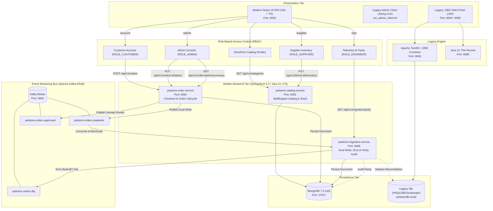

# Java Pet Store 1.3.1_02 Enterprise Modernization Platform

[](https://openjdk.org/projects/jdk/21/)
[](https://spring.io/projects/spring-boot)
[](https://www.mongodb.com/)
[](https://kafka.apache.org/)
[](https://react.dev/)
[](https://www.typescriptlang.org/)
[](https://vitejs.dev/)
[](https://github.com/deepeshgodara/petstore-migration/wiki)

An enterprise-grade, non-destructive architectural modernization of the iconic **Sun Microsystems Java Pet Store (v1.3.1_02, circa 2002)** into a high-throughput, event-driven reactive microservices platform powered by **Java 21 LTS**, **Spring Boot 3.3**, **MongoDB 7.0 (rs0)**, **Apache Kafka (KRaft)**, and **React 18 + Vite + TypeScript**.

---

## 📑 Table of Contents
1. [Architectural Highlights & Guarantees](#architectural-highlights--guarantees)
2. [Target System Architecture](#target-system-architecture)
3. [Repository Directory Structure](#repository-directory-structure)
4. [Service Directory & Runtime Port Mapping](#service-directory--runtime-port-mapping)
5. [How to Run the Migrated Application](#how-to-run-the-migrated-application)
   - [Option A: One-Command Orchestrated Startup (Recommended)](#option-a-one-command-orchestrated-startup-recommended)
   - [Option B: Step-by-Step Manual Startup](#option-b-step-by-step-manual-startup)
6. [Pre-Configured Demo Credentials & Role Access](#pre-configured-demo-credentials--role-access)
7. [Key Modern Application Features](#key-modern-application-features)
8. [How to Run the Legacy Baseline](#how-to-run-the-legacy-baseline)
   - [Option A: Native Java 21 Simulation Runner](#option-a-native-java-21-simulation-runner)
   - [Option B: Authentic 2002 Apache TomEE Container](#option-b-authentic-2002-apache-tomee-container)
   - [Legacy Swing Administration Client](#legacy-swing-administration-client)
9. [Automated Verification & Playback Suites](#automated-verification--playback-suites)
10. [Documentation & Knowledge Base](#documentation--knowledge-base)

---

## 🎯 Architectural Highlights & Guarantees

This modernization implements the **Strangler Fig Application Pattern** with enterprise-grade operational guarantees:

- **100% Isolated Legacy Baseline**: The entire original 2002 Sun Microsystems codebase resides untouched in `petstore-legacy/`.
- **Zero-Downtime Migration**: Legacy and modern systems operate concurrently with continuous synchronization.
- **Dual-Write Synchronization**: Customer transactions are captured and propagated to secondary storage via Apache Kafka.
- **Fault-Isolated Dead-Letter Queues (DLQ)**: Downstream secondary database latencies or failures never block customer checkouts or primary operations.
- **Automated Shadow Reconciliation**: A dedicated background audit engine validates data parity between legacy relational tables and MongoDB document collections.
- **Route-Packaged Modern UI**: A responsive, accessible React 18 Single-Page Application (SPA) supporting Storefront, Account, Admin, Supplier, and Ops personas.

---

## 🏛️ Target System Architecture



---

## 📁 Repository Directory Structure

The repository is cleanly partitioned into modular, purpose-driven directories:

```
petstore1.3.1_02/
├── petstore-legacy/              # [Untouched] 2002 Sun Microsystems J2EE 1.3 baseline
│   ├── src/                      # Original J2EE Java source files (apps, components, waf)
│   ├── webservices/              # Original JAX-RPC webservices
│   ├── docs/                     # Original 2002 architecture specifications & docs
│   ├── petstore.ear, opc.ear...  # Original enterprise application archives
│   ├── setup.bat, setup.sh       # Original Cloudscape database scripts
│   ├── run_admin_client.sh       # Original Swing client launch script
│   └── COPYRIGHT*, LICENSE       # Original Sun Microsystems licenses
│
├── petstore-legacy-thin-runner/  # Standalone Java 21 native simulation runner
│   ├── src/                      # Lightweight embedded HTTP controller & database models
│   ├── bin/                      # Compiled bytecode classes
│   ├── run.sh                    # Direct launch script (starts on port 8080)
│   └── README.md                 # Thin runner architecture & flow documentation
│
├── petstore-modern/              # Cloud-native microservices (Spring Boot 3.3, Java 21 LTS)
│   ├── petstore-catalog-service/ # Multilingual catalog & inventory REST API (Port 8081)
│   ├── petstore-order-service/   # Order lifecycle, checkout & dual-write publisher (Port 8082)
│   ├── petstore-migration-service/# Kafka consumer, DLQ recovery & parity audit (Port 8085)
│   ├── docker-compose.yml        # Docker compose definition for MongoDB, Kafka, UIs
│   └── pom.xml                   # Root Maven parent POM managing all microservices
│
├── petstore-frontend/            # Modern React 18 + Vite + TypeScript web application
│   ├── src/
│   │   ├── components/           # Navbar, CartDrawer, AuthModal, OrderModal
│   │   ├── pages/                # Storefront, Account, Admin, Supplier, Ops
│   │   ├── services/             # Axios API clients with Bearer token authentication
│   │   └── types/                # Strict TypeScript domain interfaces
│   ├── package.json
│   └── vite.config.ts            # Vite bundler & reverse proxy configuration
│
├── docker/                       # Docker container configuration & startup scripts
│   ├── Dockerfile                # Ubuntu 20.04 + OpenJDK 8 + TomEE 1.7.5 container image
│   ├── run_docker.sh             # Build and launch authentic 2002 baseline (Port 8000)
│   └── entrypoint.sh             # Container lifecycle entrypoint
│
├── scripts/                      # Automated verification, chaos, and operational tooling
│   ├── start_all_services.sh     # One-command startup for Docker, backend & frontend
│   ├── stop_all_services.sh      # Graceful shutdown script
│   ├── run_all_verifications.sh  # Master playback test suite executing all verifications
│   ├── verify_e2e_checkout.sh    # E2E customer checkout & MongoDB persistence verification
│   ├── verify_admin_approval.sh  # Admin approval workflow & Kafka event verification
│   ├── verify_supplier_inventory.sh # Supplier stock updates & immediate reflection
│   ├── chaos_mongo_failure_test.sh # Chaos fault-injection & DLQ isolation verification
│   ├── mongo_compass_connect.sh  # MongoDB Compass connection utility
│   └── sync_wiki.sh              # Two-way GitHub Wiki synchronization tool
│
├── wiki/                         # Comprehensive technical documentation suite
│   ├── Home.md
│   ├── Architecture-Overview.md
│   ├── Modern-High-Level-Design.md
│   ├── Modern-Low-Level-Design.md
│   ├── Legacy-PetStore-Architecture-&-Components.md
│   ├── Legacy-High-Level-Design.md
│   ├── Legacy-Low-Level-Design.md
│   ├── Service-Catalog.md
│   ├── OnCall-Support-&-Maintenance.md
│   ├── Debugging-&-Troubleshooting-Guide.md
│   └── Database-&-MongoDB-Compass-Guide.md
│
├── run.sh                        # Convenience runner launching the Java 21 thin runner
├── run_admin_client.sh           # Convenience wrapper launching the legacy Swing GUI
└── README.md                     # Master repository documentation (this file)
```

---

## 🌐 Service Directory & Runtime Port Mapping

| Service / Component | Technology Stack | Port | Purpose |
| :--- | :--- | :--- | :--- |
| **`petstore-frontend`** | React 18, Vite, TypeScript | `3000` | Modern Single-Page Application (Storefront, Account, Admin, Supplier, Ops) |
| **`petstore-catalog-service`** | Spring Boot 3.3, Java 21 LTS | `8081` | Multilingual catalog queries, inventory levels, pet metadata |
| **`petstore-order-service`** | Spring Boot 3.3, Java 21 LTS | `8082` | Customer checkout, order approval lifecycle, dual-write Kafka producer |
| **`petstore-migration-service`**| Spring Boot 3.3, Java 21 LTS | `8085` | Dual-write Kafka consumer, DLQ fault recovery, shadow parity auditor |
| **`petstore-mongo`** | MongoDB 7.0 Community (rs0) | `27017` | High-throughput document database (`petstore_orders`, `petstore_products`, etc.) |
| **`petstore-kafka`** | Confluent Kafka 7.6.1 (KRaft) | `9092` | Distributed event streaming bus (`orders.dualwrite`, `orders.approved`, `orders.dlq`) |
| **`petstore-kafka-ui`** | Provectus Labs Kafka-UI | `8087` | Web inspection of Kafka topics, message offsets, and consumer group lags |
| **`petstore-mongo-express`**| Mongo Express 1.0.2 | `8086` | Web GUI for browsing MongoDB collections, indexes, and document schemas |
| **`petstore-baseline` (TomEE)**| Apache TomEE Plus 1.7.5 | `8000` / `8088`| Authentic 2002 J2EE 1.3 container executing original EAR archives |
| **`petstore-legacy-thin-runner`**| Native Java 21 LTS | `8080` | Zero-dependency standalone simulation runner for the legacy application |

---

## 🚀 How to Run the Migrated Application

### Prerequisites
- **Operating System**: macOS (Apple Silicon / Intel), Linux, or Windows (WSL2)
- **Java**: OpenJDK 21 LTS or Eclipse Temurin 21 (`java -version`)
- **Maven**: Apache Maven 3.9+ (`mvn -version`)
- **Node.js**: Node 18.x or 20.x with npm (`node -v && npm -v`)
- **Docker**: Docker Engine 24+ and Docker Compose v2 (`docker compose version`)

---

### Option A: One-Command Orchestrated Startup (Recommended)

To start the entire modern platform—including Docker containers (MongoDB, Kafka, Kafka-UI, Mongo-Express), all 3 Spring Boot microservices, and the React 18 frontend—execute:

```bash
./scripts/start_all_services.sh
```

The script verifies Docker readiness, launches backend processes in the background, starts the Vite development server, verifies HTTP endpoint health, and prints the operational dashboard:

```
===================================================================
  PET STORE PLATFORM IS UP AND RUNNING!
===================================================================
  Modern Storefront:       http://localhost:3000/
  Customer Account:        http://localhost:3000/account
  Admin Dashboard:         http://localhost:3000/admin
  Supplier Inventory:      http://localhost:3000/supplier
  Migration Parity Monitor: http://localhost:3000/ops
  Kafka UI Management:     http://localhost:8087
  Mongo Express DB Admin:  http://localhost:8086
  Legacy Pet Store (TomEE): http://localhost:8000/petstore/
===================================================================
```

To stop all services and containers gracefully:
```bash
./scripts/stop_all_services.sh
```

---

### Option B: Step-by-Step Manual Startup

If you prefer to start each component individually in dedicated terminal windows:

#### Step 1: Start Infrastructure Containers (Docker Compose)
```bash
cd petstore-modern
docker compose up -d
```
Verify containers are healthy:
```bash
docker ps --format "table {{.Names}}\t{{.Status}}\t{{.Ports}}"
```

#### Step 2: Build & Launch Modern Backend Microservices
Open three terminal windows:

```bash
# Terminal 1: Launch Catalog Service (Port 8081)
cd petstore-modern
mvn -pl petstore-catalog-service spring-boot:run

# Terminal 2: Launch Order Service (Port 8082)
cd petstore-modern
mvn -pl petstore-order-service spring-boot:run

# Terminal 3: Launch Migration & Dual-Write Service (Port 8085)
cd petstore-modern
mvn -pl petstore-migration-service spring-boot:run
```

#### Step 3: Launch Modern Frontend
```bash
cd petstore-frontend
npm install
npm run dev
```

Open your browser to **`http://localhost:3000/`**.

---

## 🔐 Pre-Configured Demo Credentials & Role Access

The modern platform uses Role-Based Access Control (RBAC). The login modal includes one-click demo profile badges:

| Identity | Username | Password | Assigned Role | Route Permissions | Description |
| :--- | :--- | :--- | :--- | :--- | :--- |
| **Customer** | `j2ee` | `j2ee` | `ROLE_CUSTOMER` | `/`, `/account` | Browse catalog, manage persistent cart, place orders, view personal order history. |
| **Admin** | `admin` | `admin123` | `ROLE_ADMIN` | `/`, `/account`, `/admin`, `/supplier` | Modern replacement for Swing Admin client. Approve/reject orders, view sales KPI analytics. |
| **Supplier** | `supplier` | `supplier` | `ROLE_SUPPLIER` | `/`, `/supplier` | Modern replacement for `supplier.ear`. Manage warehouse inventory, edit stock quantities. |
| **Engineer / Ops** | `engineer` | `eng123` | `ROLE_ENGINEER` | `/`, `/ops` | Telemetry dashboard, dual-write health, trigger shadow parity audits, MongoDB Compass metrics. |
| **Super Admin** | `root` | `root123` | `ROLE_SUPERADMIN` | *All Routes* | Unrestricted system-wide access across all routes and features. |

---

## ✨ Key Modern Application Features

### 1. Storefront & Multi-Language Cart (`/`)
- Dynamic pet catalog with category filtering across all 5 pet categories (Fish, Dogs, Reptiles, Cats, Birds) and 28 items.
- 43 authentic GIF pet assets dynamically loaded and displayed.
- **Language Switcher**: English (`en_US`), Japanese (`ja_JP`), and Chinese (`zh_CN`). Cart items automatically preserve the language in which they were added to the cart, even when the storefront language changes.
- Slide-over conversational cart drawer with real-time subtotal calculation and checkout modal.

### 2. Admin Portal & Sales Category Analytics (`/admin`)
- Complete modern web replacement for the authentic 2002 Java Web Start / Swing desktop client (`AdminApp.jar`).
- **Pending Orders Queue**: One-click order approval or rejection emitting Kafka events (`petstore.orders.approved`).
- **Interactive Sales & Category Analytics (React SPA)**:
  - Date range filtering (7 Days, 30 Days, 90 Days, 1 Year).
  - Dynamic **SVG Category Breakdown Donut Chart** showing sales volume by pet category.
  - Dynamic **SVG Category Volume Bar Chart**.
  - **Cohort Metrics**: Unique customer count, returning customer rate, and average order value.

### 3. Supplier Inventory Management (`/supplier`)
- Modern web replacement for the legacy JSP supplier portal (`supplier.ear`).
- Live table of all 28 product SKUs with category, unit cost, list price, and stock levels.
- Real-time stock status badges (`In Stock`, `Low Stock`, `Out of Stock`) and progress bars.
- One-click stock updates that write directly to MongoDB (`petstore_products`) and immediately reflect across customer storefront search and item detail views.

### 4. Telemetry & MongoDB Compass Diagnostics (`/ops`)
- Live Dual-Write replication monitor tracking orders processed, lag, and dead-letter queue (DLQ) state.
- On-demand **Shadow Reconciliation Audit** comparing relational database records against MongoDB.
- **Live Database Diagnostics**: MongoDB cluster health, active connections, database size, and collection counts.
- **MongoDB Compass Integration**: One-click connection string copy (`mongodb://localhost:27017/petstore?replicaSet=rs0`) and command launcher (`./scripts/mongo_compass_connect.sh`).

---

## 🏛️ How to Run the Legacy Baseline

The repository provides two independent options to run the legacy baseline for historical comparison:

### Option A: Native Java 21 Simulation Runner (Fastest, Zero Dependencies)

The `petstore-legacy-thin-runner/` module is a zero-dependency, native Java 21 LTS simulation engine. It runs directly on macOS, Linux, and Windows without Docker or heavy J2EE containers:

```bash
# Launch from project root:
./run.sh

# Or directly from the runner directory:
cd petstore-legacy-thin-runner
./run.sh
```

- **Storefront URL**: `http://localhost:8080/petstore/`
- **Admin URL**: `http://localhost:8080/petstore/admin`
- **Supplier URL**: `http://localhost:8080/petstore/supplier`

---

### Option B: Authentic 2002 Apache TomEE Container (Full J2EE Container)

To run the authentic 2002 application inside an Apache TomEE Plus container running OpenJDK 8 on port 8000:

```bash
./docker/run_docker.sh
```

- **Storefront URL**: `http://localhost:8000/petstore/`
- **Admin Portal URL**: `http://localhost:8000/admin/AdminRequestProcessor`
- **Supplier Portal URL**: `http://localhost:8000/supplier/RcvrRequestProcessor`
- **Credentials**: `j2ee` / `j2ee` (Customer), `jps_admin` / `admin` (Admin), `supplier` / `supplier` (Supplier)

---

### Legacy Swing Administration Client

The legacy Pet Store admin application was originally distributed via Java Web Start (`AdminApp.jar`). To launch the authentic Swing desktop application on your local machine:

```bash
# Ensure the TomEE container is running on port 8000, then execute:
./run_admin_client.sh
```

The script extracts `AdminApp.jar` from `petstore-legacy/petstoreadmin.ear`, authenticates with the container admin portal on port 8000, and opens the native Java Swing desktop window.

---

## 🧪 Automated Verification & Playback Suites

The `scripts/` directory provides standalone, automated verification suites designed for CI/CD pipelines and interview playback:

### Master Verification Runner
Executes all verification suites sequentially with automated assertion reporting:
```bash
./scripts/run_all_verifications.sh
```

### Individual Playback Suites
```bash
# 1. E2E Checkout & MongoDB Write Propagation
./scripts/verify_e2e_checkout.sh

# 2. Modern Admin Approval Workflow & Kafka Event Emission
./scripts/verify_admin_approval.sh

# 3. Supplier Inventory Updates & Real-Time Stock Sync
./scripts/verify_supplier_inventory.sh

# 4. Chaos Experiment (Simulate MongoDB Outage, Verify Zero Blast Radius & DLQ Isolation)
./scripts/chaos_mongo_failure_test.sh
```

### Running Backend Unit Tests
```bash
cd petstore-modern
export JAVA_HOME="/Library/Java/JavaVirtualMachines/jdk-21.jdk/Contents/Home"
mvn clean test -pl petstore-catalog-service,petstore-order-service,petstore-migration-service
```
- **76 unit & integration tests** across all microservices.
- **100% test pass rate with 0 failures and 0 errors**.

### Running Frontend Build & Typecheck
```bash
cd petstore-frontend
npm run build
```
- Fully type-checked TypeScript compilation and optimized production bundle.

---

## 📚 Documentation & Knowledge Base

For in-depth architectural analyses, operational playbooks, and runbooks, consult the repository documentation:

| Document | Link | Description |
| :--- | :--- | :--- |
| **GitHub Wiki** | [PetStore Migration Wiki](https://github.com/deepeshgodara/petstore-migration/wiki) | Complete knowledge base: Architecture, HLD/LLD diagrams, Service Catalog, On-Call Runbooks, and Troubleshooting. |
| **Modern Architecture HLD & LLD** | [`Modern-High-Level-Design`](wiki/Modern-High-Level-Design.md) / [`Modern-Low-Level-Design`](wiki/Modern-Low-Level-Design.md) | High-Level and Low-Level diagrams for the migrated modern application (Classes, Sequences, MongoDB ER, State Machines, Flowcharts). |
| **Legacy Architecture HLD & LLD** | [`Legacy-High-Level-Design`](wiki/Legacy-High-Level-Design.md) / [`Legacy-Low-Level-Design`](wiki/Legacy-Low-Level-Design.md) | High-Level and Low-Level diagrams for the 2002 baseline (WAF MVC, EJB CMP, FastLane, relational schemas, JMS). |
| **Modernization Design Doc** | [`MODERNIZATION_DESIGN_DOC.md`](MODERNIZATION_DESIGN_DOC.md) | Comprehensive 48KB architectural specification covering schema transformations, dual-write mechanics, and event schemas. |
| **Docker Operations Guide** | [`DOCKER_GUIDE.md`](DOCKER_GUIDE.md) | Deep dive into the legacy container, OpenEJB configuration, and port mappings. |
| **Project History & Issues** | [`PROJECT_HISTORY_AND_ISSUES.md`](PROJECT_HISTORY_AND_ISSUES.md) | Chronological log of all engineering challenges encountered and resolved during modernization. |

---

*Authored as part of the Java Pet Store 1.3.1_02 Enterprise Modernization Initiative (2026).*
