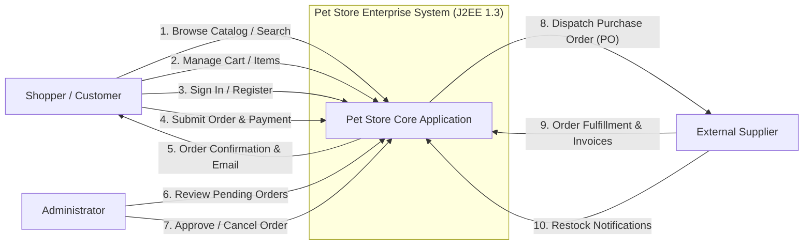
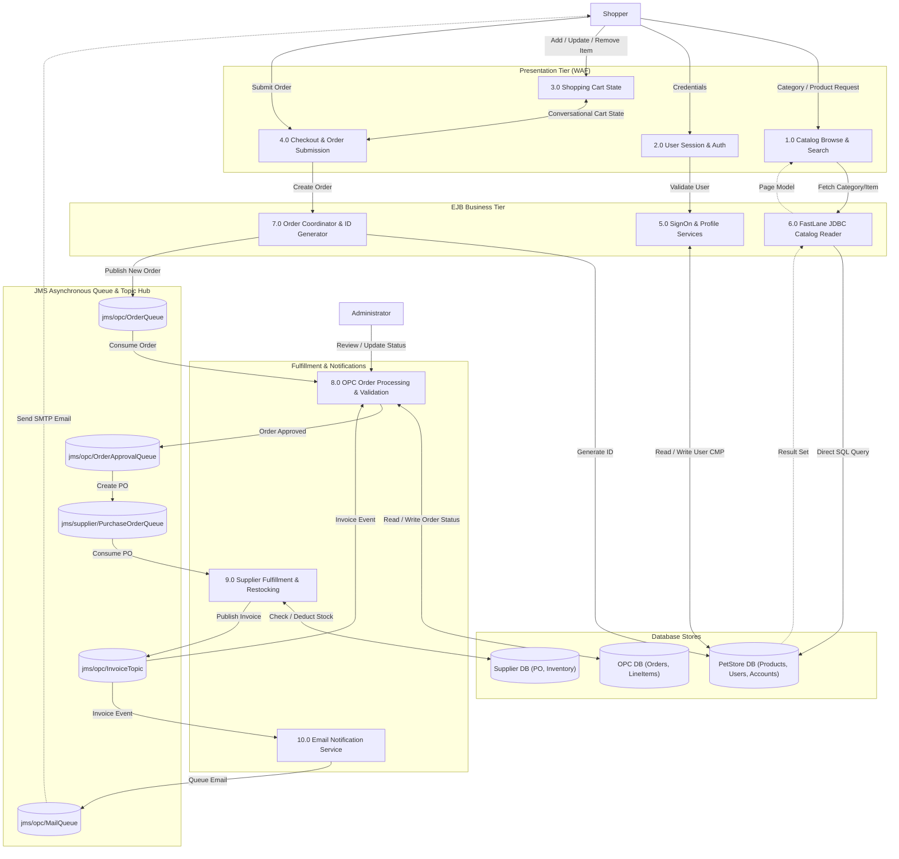
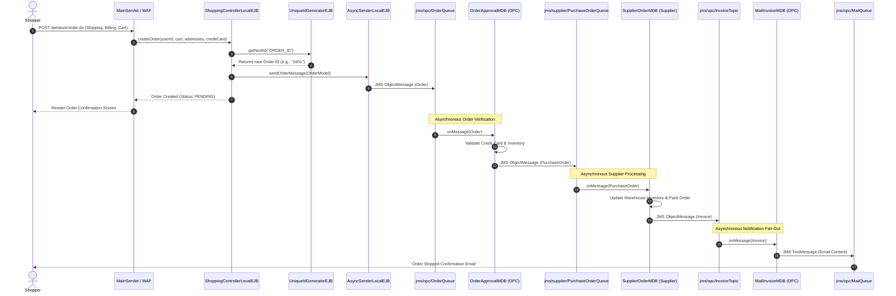

# High-Level Design (HLD): Data Flow Diagrams (DFD)

This document presents the **Level 0 (Context)**, **Level 1 (Subsystems)**, and **Level 2 (Order & Async Event Processing)** Data Flow Diagrams for the 2002 Java Pet Store baseline.

---

## 1. DFD Level 0: System Context Diagram

The Level 0 diagram defines the system boundary and the interactions with external entities: **Shopper (Customer)**, **Administrator**, and **External Supplier**.

---

## 2. DFD Level 1: Subsystem Data Flow

The Level 1 diagram breaks down internal components: **Catalog Browsing**, **User & Account Management**, **Shopping Cart**, **Order Controller**, **OPC Messaging Subsystem**, and **Supplier Fulfillment**.

---

## 3. DFD Level 2: Detailed Order Lifecycle & Asynchronous JMS Flow

The Level 2 diagram captures the exact asynchronous event flow from initial checkout click to order finalization and notification.

