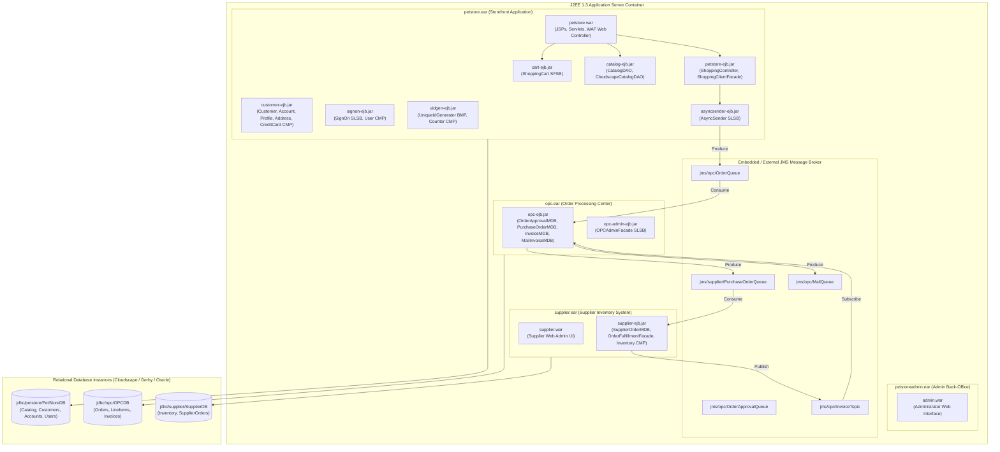

# High-Level Design (HLD): Deployment Diagram

This document details the physical and logical packaging, enterprise application archive (EAR) boundaries, and container deployment structure of the 2002 Java Pet Store application.

---

## 1. Enterprise Application Packaging Structure

The baseline application is split into four `.ear` archives deployed inside a **J2EE 1.3 Container** (such as Apache TomEE Plus / JBoss 3.2 / Sun Java System Application Server):

---

## 2. Component Inventory & Container Modules

### 2.1 Web Tier Modules (WAR)
| Archive | Context Root | Description & Key Servlets |
| :--- | :--- | :--- |
| `petstore.war` | `/petstore` | Main customer-facing storefront. Contains `MainServlet` (Front Controller), `TemplateServlet` (Layout Engine), `PopulateServlet` (Database Seeder), and standard JSTL taglibs. |
| `supplier.war` | `/supplier` | Supply-chain partner portal for checking inventory stock levels and manually triggering re-stocks. |
| `admin.war` | `/admin` | Store administrator dashboard for viewing orders, approving pending purchases, and tracking status. |

### 2.2 Enterprise JavaBean Modules (EJB-JAR)
| EJB JAR | EJB Name | Type | Purpose |
| :--- | :--- | :--- | :--- |
| `petstore-ejb.jar` | `ShoppingControllerEJB` | Stateless Session (SLSB) | Manages order creation, customer checkout transaction coordination. |
| `petstore-ejb.jar` | `ShoppingClientFacadeEJB` | Stateful Session (SFSB) | Conversational facade for an active customer browsing and purchasing. |
| `cart-ejb.jar` | `ShoppingCartEJB` | Stateful Session (SFSB) | Manages in-memory shopping cart items and subtotals. |
| `signon-ejb.jar` | `SignOnEJB` | Stateless Session (SLSB) | Handles password verification and authentication. |
| `signon-ejb.jar` | `UserEJB` | Entity Bean (CMP 2.0) | Stores username and password credentials. |
| `customer-ejb.jar` | `CustomerEJB` | Entity Bean (CMP 2.0) | Manages customer identity and preferences. |
| `customer-ejb.jar` | `AccountEJB` | Entity Bean (CMP 2.0) | Contains contact info, billing info, and credit card relationships. |
| `uidgen-ejb.jar` | `UniqueIdGeneratorEJB` | Entity Bean (BMP) | Generates monotonic unique ID sequences using transactional block allocation. |
| `asyncsender-ejb.jar` | `AsyncSenderEJB` | Stateless Session (SLSB) | JMS message publisher for order events. |
| `opc-ejb.jar` | `OrderApprovalMDB` | Message-Driven (MDB) | Consumes `OrderQueue`, validates order limits. |
| `opc-ejb.jar` | `PurchaseOrderMDB` | Message-Driven (MDB) | Consumes approved orders, issues PO messages to suppliers. |
| `opc-ejb.jar` | `InvoiceMDB` | Message-Driven (MDB) | Consumes invoices published by suppliers. |
| `opc-ejb.jar` | `MailInvoiceMDB` | Message-Driven (MDB) | Consumes invoices, formats confirmation emails for `MailQueue`. |
| `supplier-ejb.jar` | `SupplierOrderMDB` | Message-Driven (MDB) | Consumes `PurchaseOrderQueue`, adjusts inventory stock. |
| `supplier-ejb.jar` | `InventoryEJB` | Entity Bean (CMP 2.0) | Represents warehouse stock counts per item. |

### 2.3 JMS Destination Registry
| Destination Name | JNDI Lookup Name | Type | Producers | Consumers |
| :--- | :--- | :--- | :--- | :--- |
| `OrderQueue` | `jms/opc/OrderQueue` | Queue (P2P) | `AsyncSenderEJB` | `OrderApprovalMDB` |
| `OrderApprovalQueue` | `jms/opc/OrderApprovalQueue` | Queue (P2P) | `OrderApprovalMDB` | `PurchaseOrderMDB` |
| `PurchaseOrderQueue` | `jms/supplier/PurchaseOrderQueue` | Queue (P2P) | `PurchaseOrderMDB` | `SupplierOrderMDB` |
| `InvoiceTopic` | `jms/opc/InvoiceTopic` | Topic (Pub/Sub)| `SupplierOrderMDB` | `InvoiceMDB`, `MailInvoiceMDB` |
| `MailQueue` | `jms/opc/MailQueue` | Queue (P2P) | `MailInvoiceMDB` | `MailerService` (SMTP) |
