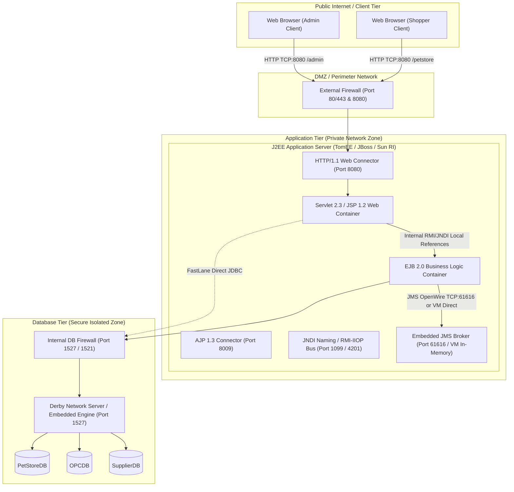

# High-Level Design (HLD): Network Topology

This document details the network connectivity, ports, protocols, security boundaries, and communication paths across the baseline 2002 Java Pet Store deployment.

---

## 1. Network Boundary & Topology Diagram

---

## 2. Port & Protocol Registry

| Protocol | Default Port | Source | Destination | Purpose |
| :--- | :--- | :--- | :--- | :--- |
| **HTTP 1.1** | `8080` | Web Browser Clients | Application Server | Storefront web navigation, shopping cart actions, JSP templates, image downloads, REST-like form posts. |
| **AJP 1.3** | `8009` | Apache Web Server / Mod_JK | Application Server | Reverse proxy routing for production J2EE deployments. |
| **RMI-IIOP** | `1099` / `4201` | Web Container / Client | EJB Container | Remote Enterprise JavaBean method invocations and JNDI context lookups. |
| **JMS (OpenWire)** | `61616` / `vm://` | AsyncSenderEJB / MDBs | ActiveMQ Broker | Asynchronous queue and topic message delivery for orders, invoices, and mail. |
| **JDBC** | `1527` (Derby) / `1521` (Oracle) | EJB Container / FastLane DAO | Database Engine | Relational persistence, transactions, and data seeding. |
| **SMTP** | `25` | Mailer Service | Mail Server | Dispatching order confirmation emails to customers. |

---

## 3. Communication Patterns

1. **Synchronous HTTP Request-Response**:
   - The browser maintains a stateful session via the `JSESSIONID` HTTP cookie.
   - All front controller requests are submitted synchronously to `http://localhost:8080/petstore/`.
2. **In-JVM Local EJB Inter-Process Communication**:
   - Servlets and Web Controllers invoke EJB 2.0 Local Homes (`EJBLocalHome`) and Local Interfaces (`EJBLocalObject`) within the same JVM memory space, eliminating RMI serialization overhead.
3. **Asynchronous P2P and Pub/Sub Messaging**:
   - Cross-subsystem coordination (Storefront -> Order Processing Center -> Supplier) is completely decoupled using message queues (`OrderQueue`, `PurchaseOrderQueue`) and topics (`InvoiceTopic`).
