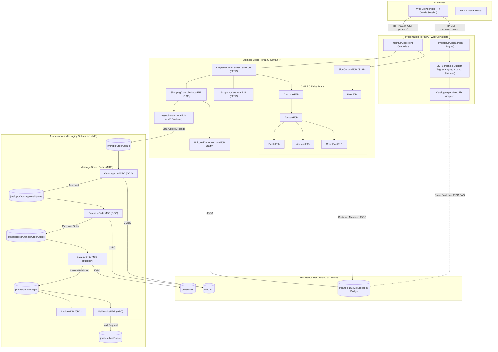

# High-Level Design (HLD): System Architecture

## 1. Executive Architecture Overview

The **Java™ Pet Store Demo 1.3.1_02** is structured as an **N-Tier Enterprise Architecture** adhering to the Sun J2EE 1.3.1 BluePrints pattern. The system is decomposed into four primary decoupled enterprise applications:
1. **PetStore Web & Storefront (`petstore.ear`)**: Front-facing e-commerce storefront for browsing pet categories, managing shopping carts, customer account management, and placing orders.
2. **Order Processing Center - OPC (`opc.ear`)**: Enterprise integration hub managing asynchronous order validation, credit approval, invoicing, and email notification via JMS Message-Driven Beans (MDBs).
3. **Supplier Subsystem (`supplier.ear`)**: Independent supply-chain fulfillment and inventory tracking system.
4. **PetStore Administrator (`petstoreadmin.ear`)**: Administrative back-office client for managing inventory and order statuses.

---

## 2. Subsystem Descriptions

### 2.1 PetStore Web & Storefront (`petstore.ear`)
- **Web Application Framework (WAF)**: Implements an early MVC design pattern. Requests are routed through `MainServlet`, which delegates to `WebController` and `FlowHandler` to execute business actions and choose target screen definitions.
- **Fast Lane Reader Pattern**: A critical architectural pattern in 2002. Instead of loading read-only product catalog items through heavy EJB 2.0 entity beans, `CatalogHelper` directly invokes `CloudscapeCatalogDAO` to run fast scrolling SQL queries against `PetStoreDB`.
- **Conversational State**: Shopping carts and user context are preserved in memory via Stateful Session Beans (`ShoppingCartLocalEJB`, `ShoppingClientFacadeLocalEJB`) tied to HTTP session cookies.

### 2.2 Order Processing Center - OPC (`opc.ear`)
- **Enterprise Service Bus (JMS)**: Acts as the decoupled backend orchestration layer.
- When an order is placed in the storefront, `AsyncSenderEJB` sends an asynchronous `OrderQueue` message.
- `OrderApprovalMDB` verifies credit limit and inventory.
- Once approved, `PurchaseOrderMDB` generates a formal Purchase Order (PO) and routes it to the external `PurchaseOrderQueue`.

### 2.3 Supplier Subsystem (`supplier.ear`)
- Represents an external 3rd-party pet breeder/supplier.
- Consumes messages from `PurchaseOrderQueue` via `SupplierOrderMDB`.
- Restocks items, checks physical warehouse stock (`InventoryEJB`), and generates an `Invoice` published to `jms/opc/InvoiceTopic`.

### 2.4 Persistence Layer
- **CMP 2.0 (Container-Managed Persistence)**: Relational mapping for customer profiles, credit cards, addresses, and user accounts.
- **BMP (Bean-Managed Persistence)**: Used by `UniqueIdGeneratorEJB` to manage transaction-safe unique ID block allocation.
- **Direct JDBC (FastLane DAO)**: High-performance read queries for Categories, Products, and Items.
