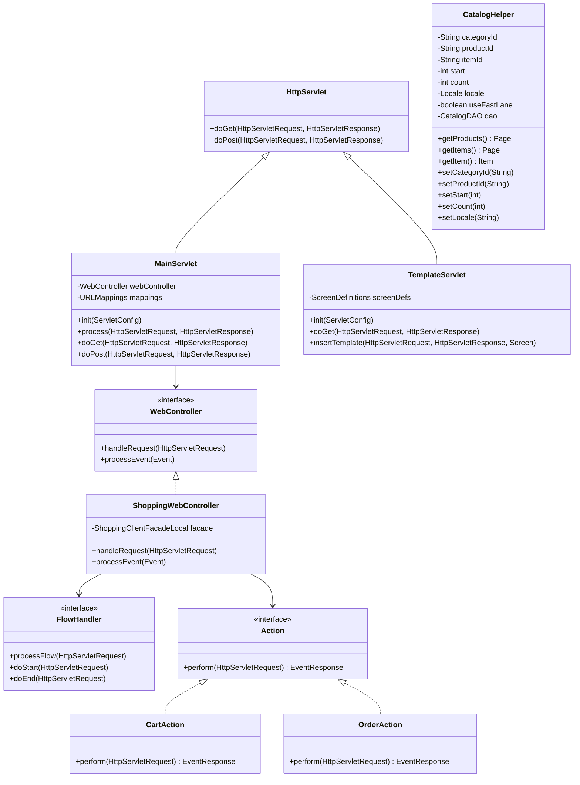
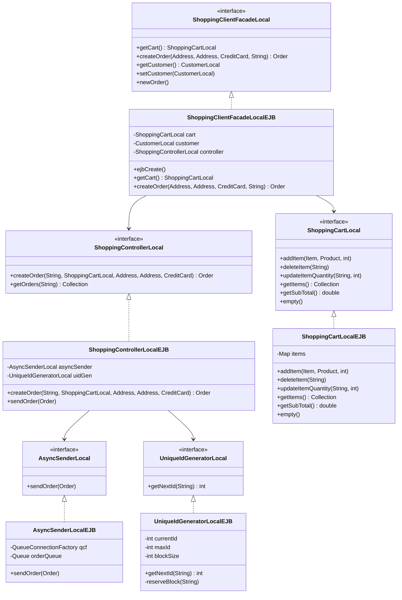
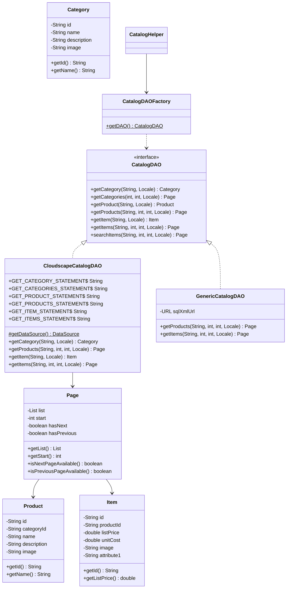
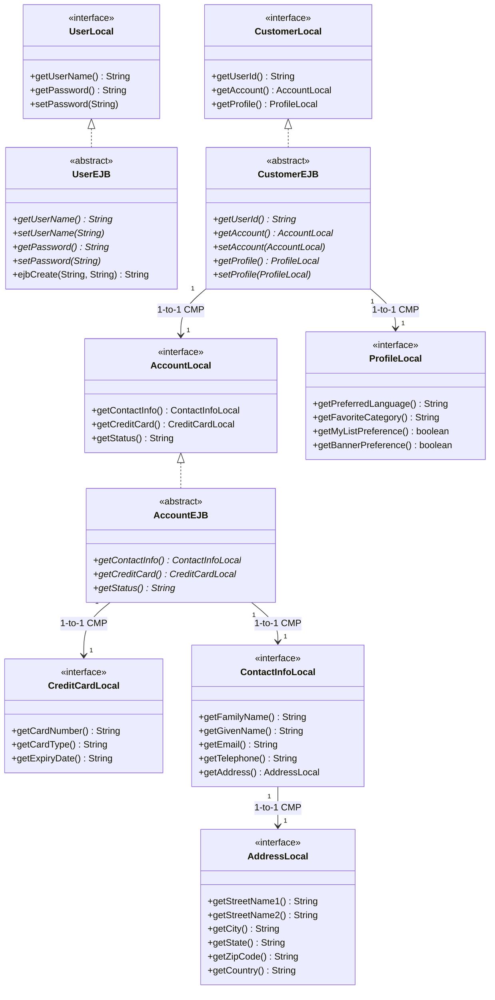

# Low-Level Design (LLD): Class Diagrams

This document contains detailed class diagrams covering the four core layers of the 2002 Java Pet Store application:
1. **Web Application Framework (WAF) & Presentation Tier**
2. **Session Facade & Business Tier**
3. **FastLane Reader Catalog DAO Tier**
4. **CMP 2.0 Entity Bean Tier**

---

## 1. WAF Presentation Tier Class Diagram

The Web Application Framework (WAF) implements the Model-View-Controller (MVC) pattern for Servlet 2.3 and JSP 1.2.

---

## 2. Session Facade & Business Tier Class Diagram

---

## 3. FastLane Reader Catalog DAO Pattern Class Diagram

The **Fast Lane Reader** pattern allows presentation-tier helpers to execute high-speed relational queries without EJB container overhead.

---

## 4. CMP 2.0 Entity Bean Tier Class Diagram

Container-Managed Persistence (CMP 2.0) defines abstract getter/setter methods managed by the EJB container.

