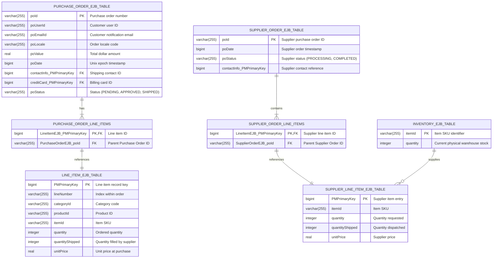

# Low-Level Design (LLD): Entity-Relationship (ER) Diagrams

This document contains the complete database schemas, table definitions, primary keys, foreign keys, data types, and relationships across the three relational databases in the 2002 Java Pet Store baseline:
1. **PetStoreDB** (Catalog, Customer, User, Profile, Account, Address, CreditCard, Counter)
2. **OPCDB** (Order Processing Center: Orders, Purchase Orders, Line Items, Invoices)
3. **SupplierDB** (Supplier Orders, Inventory Items)

---

## 1. PetStoreDB Physical Schema

```mermaid
erDiagram
    CATEGORY ||--|{ CATEGORY_DETAILS : "has localized names"
    CATEGORY ||--o{ PRODUCT : "contains"
    PRODUCT ||--|{ PRODUCT_DETAILS : "has localized details"
    PRODUCT ||--o{ ITEM : "contains variations"
    ITEM ||--|{ ITEM_DETAILS : "has localized pricing & image"

    USER_EJB_TABLE ||--|| CUSTOMER_EJB_TABLE : "authenticates"
    CUSTOMER_EJB_TABLE ||--|| ACCOUNT_EJB_TABLE : "has account"
    CUSTOMER_EJB_TABLE ||--|| PROFILE_EJB_TABLE : "has preferences"
    ACCOUNT_EJB_TABLE ||--|| CONTACT_INFO_EJB_TABLE : "has contact info"
    ACCOUNT_EJB_TABLE ||--|| CREDIT_CARD_EJB_TABLE : "has payment method"
    CONTACT_INFO_EJB_TABLE ||--|| ADDRESS_EJB_TABLE : "has address"

    CATEGORY {
        varchar(10) catid PK "Category identifier (e.g. FISH, DOGS)"
    }

    CATEGORY_DETAILS {
        varchar(10) catid PK,FK "Category identifier"
        varchar(10) locale PK "Locale (e.g. en_US, ja_JP, zh_CN)"
        varchar(80) name "Localized category display name"
        varchar(255) image "Category icon filename"
        varchar(255) descn "Category description"
    }

    PRODUCT {
        varchar(10) productid PK "Product identifier (e.g. FI-SW-01)"
        varchar(10) catid FK "Parent category ID"
    }

    PRODUCT_DETAILS {
        varchar(10) productid PK,FK "Product identifier"
        varchar(10) locale PK "Locale code"
        varchar(80) name "Localized product name"
        varchar(255) image "Product image filename"
        varchar(255) descn "Detailed product description"
    }

    ITEM {
        varchar(10) itemid PK "Item stock keeping unit (e.g. EST-1)"
        varchar(10) productid FK "Parent product ID"
    }

    ITEM_DETAILS {
        varchar(10) itemid PK,FK "Item SKU identifier"
        varchar(10) locale PK "Locale code"
        decimal(10,2) listprice "Retail customer price"
        decimal(10,2) unitcost "Wholesale supplier unit cost"
        varchar(255) image "Item detail picture"
        varchar(255) descn "Item description"
        varchar(80) attr1 "Attribute 1 (e.g. Male, Female)"
        varchar(80) attr2 "Attribute 2 (e.g. Small, Large)"
        varchar(80) attr3 "Attribute 3"
        varchar(80) attr4 "Attribute 4"
        varchar(80) attr5 "Attribute 5"
    }

    USER_EJB_TABLE {
        varchar(255) userName PK "Sign-on username (e.g. j2ee)"
        varchar(255) password "Plaintext password"
    }

    CUSTOMER_EJB_TABLE {
        varchar(255) userId PK "Customer user ID"
        bigint account_PMPrimaryKey FK "Foreign key to Account"
        bigint profile_PMPrimaryKey FK "Foreign key to Profile"
    }

    ACCOUNT_EJB_TABLE {
        bigint PMPrimaryKey PK "Generated primary key"
        varchar(255) reverse_account_userId "Reverse lookup user ID"
        bigint contactInfo_PMPrimaryKey FK "Foreign key to ContactInfo"
        bigint creditCard_PMPrimaryKey FK "Foreign key to CreditCard"
        varchar(255) status "Account status (e.g. OK)"
    }

    PROFILE_EJB_TABLE {
        bigint PMPrimaryKey PK "Generated primary key"
        varchar(255) reverse_profile_userId "Reverse lookup user ID"
        varchar(255) preferredLanguage "Preferred locale (e.g. en_US)"
        varchar(255) favoriteCategory "Favorite category ID"
        smallint myListPreference "MyList preference boolean"
        smallint bannerPreference "Banner preference boolean"
    }

    CONTACT_INFO_EJB_TABLE {
        bigint PMPrimaryKey PK "Generated primary key"
        varchar(255) reverse_contactInfo_PMPrimaryKey "Reverse lookup"
        bigint address_PMPrimaryKey FK "Foreign key to Address"
        varchar(255) familyName "Customer last name"
        varchar(255) givenName "Customer first name"
        varchar(255) email "Email address"
        varchar(255) telephone "Phone number"
    }

    ADDRESS_EJB_TABLE {
        bigint PMPrimaryKey PK "Generated primary key"
        varchar(255) reverse_address_PMPrimaryKey "Reverse lookup"
        varchar(255) streetName1 "Street line 1"
        varchar(255) streetName2 "Street line 2"
        varchar(255) city "City"
        varchar(255) state "State / Province"
        varchar(255) zipCode "Postal code"
        varchar(255) country "Country"
    }

    CREDIT_CARD_EJB_TABLE {
        bigint PMPrimaryKey PK "Generated primary key"
        varchar(255) reverse_creditCard_PMPrimaryKey "Reverse lookup"
        varchar(255) cardNumber "Credit card number"
        varchar(255) cardType "Card brand (Visa, MasterCard)"
        varchar(255) expiryDate "Expiration date (MM/YY)"
    }

    COUNTER_EJB_TABLE {
        varchar(255) name PK "Counter identifier (e.g. ORDER_ID)"
        integer counter "Current sequence high-water mark"
    }
```

---

## 2. OPC (Order Processing Center) & Supplier Database Schema


