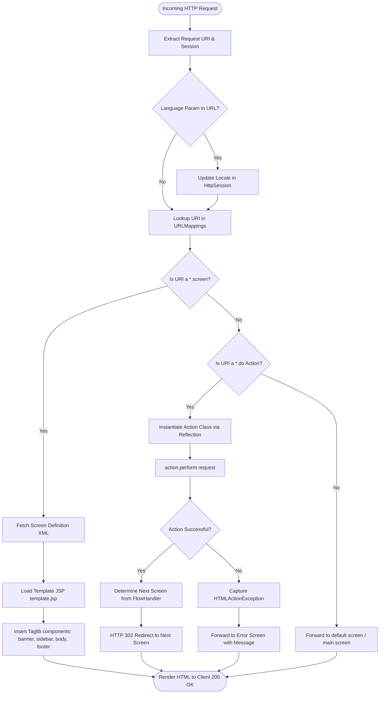
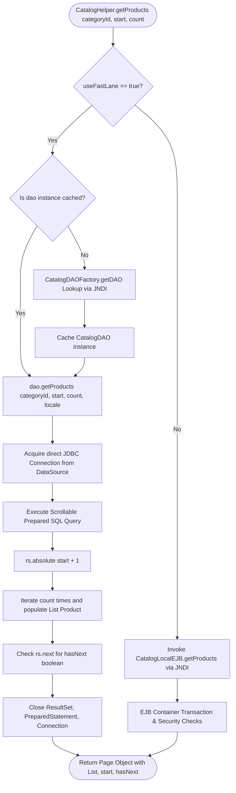
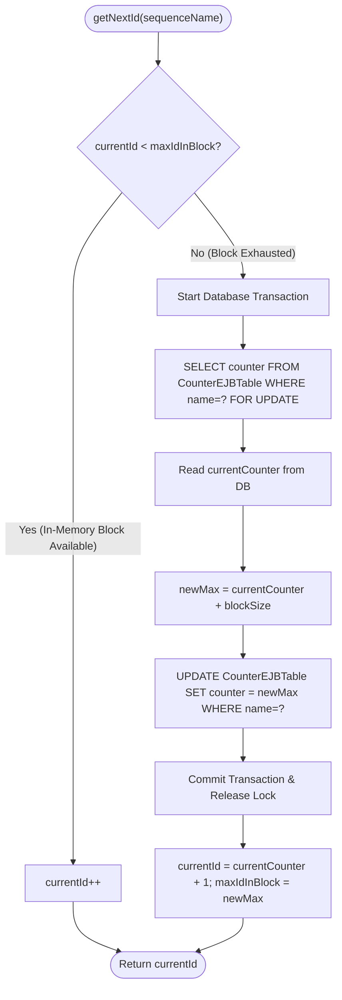

# Low-Level Design (LLD): Flowcharts and Pseudocode

This document provides exact algorithmic flowcharts and pseudocode for the three most complex control structures in the 2002 Java Pet Store:
1. **WAF Front Controller (`MainServlet.process`) Pipeline**
2. **FastLane vs EJB Routing Decision Algorithm in `CatalogHelper`**
3. **Block Allocation Sequence Generator Algorithm in `UniqueIdGeneratorEJB`**

---

## 1. WAF Front Controller Request Processing Pipeline

### 1.1 Flowchart



### 1.2 Pseudocode for `MainServlet.process()`

```java
public void process(HttpServletRequest request, HttpServletResponse response) 
    throws ServletException, IOException {
    
    HttpSession session = request.getSession(true);
    String path = request.getPathInfo();
    
    // 1. Locale synchronization
    String lang = request.getParameter("locale");
    if (lang != null && !lang.isEmpty()) {
        session.setAttribute("com.sun.j2ee.blueprints.waf.locale", new Locale(lang));
    }
    
    // 2. Screen routing vs Action execution
    if (path.endsWith(".screen")) {
        String screenName = path.substring(1, path.indexOf(".screen"));
        Screen screen = screenDefinitions.getScreen(screenName);
        request.setAttribute("CURRENT_SCREEN", screen);
        RequestDispatcher rd = request.getRequestDispatcher(screen.getTemplateName());
        rd.forward(request, response);
        return;
    }
    
    if (path.endsWith(".do")) {
        ActionMapping mapping = urlMappings.getMapping(path);
        try {
            Action action = (Action) Class.forName(mapping.getActionClass()).newInstance();
            EventResponse eventResponse = action.perform(request);
            
            FlowHandler flowHandler = getFlowHandler(mapping);
            String nextScreen = flowHandler.getNextScreen(request, eventResponse);
            response.sendRedirect(nextScreen + ".screen");
        } catch (HTMLActionException e) {
            request.setAttribute("javax.servlet.jsp.jspException", e);
            request.getRequestDispatcher("/error.jsp").forward(request, response);
        }
    }
}
```

---

## 2. FastLane Reader Routing Algorithm (`CatalogHelper`)

### 2.1 Flowchart



### 2.2 Pseudocode for `CatalogHelper.getProducts()`

```java
public Page getProducts(String categoryId, int start, int count, Locale locale) 
    throws CatalogException {
    
    if (this.useFastLane) {
        try {
            if (this.dao == null) {
                // JNDI Lookup of DAO implementation class name
                this.dao = CatalogDAOFactory.getDAO();
            }
            // Direct JDBC FastLane execution
            return this.dao.getProducts(categoryId, start, count, locale);
        } catch (CatalogDAOSysException se) {
            throw new CatalogException("FastLane Query Failed: " + se.getMessage());
        }
    } else {
        // Fallback to full EJB component invocation
        CatalogLocal ejb = getCatalogEJB();
        return ejb.getProducts(categoryId, start, count, locale);
    }
}
```

---

## 3. Block Allocation Unique ID Generation Algorithm (`UniqueIdGeneratorEJB`)

The 2002 Pet Store uses a **Transactional High-Low Block Reservation Algorithm** to avoid database bottlenecks when generating unique IDs for orders and accounts.

### 3.1 Flowchart



### 3.2 Pseudocode for `UniqueIdGeneratorEJB.getNextId()`

```java
public synchronized int getNextId(String sequenceName) throws CreateException {
    // 1. If we still have pre-allocated IDs in our in-memory block, return next
    if (this.currentId < this.maxId) {
        this.currentId++;
        return this.currentId;
    }
    
    // 2. Block exhausted: allocate a new block from the database atomically
    Connection conn = null;
    PreparedStatement selectStmt = null;
    PreparedStatement updateStmt = null;
    try {
        conn = getDataSource().getConnection();
        conn.setAutoCommit(false);
        
        // Lock row with FOR UPDATE or single-row transaction
        selectStmt = conn.prepareStatement("SELECT counter FROM Counter WHERE name = ?");
        selectStmt.setString(1, sequenceName);
        ResultSet rs = selectStmt.executeQuery();
        
        int dbCounter = 0;
        if (rs.next()) {
            dbCounter = rs.getInt(1);
        }
        rs.close();
        
        int newDbCounter = dbCounter + this.blockSize; // Default blockSize = 10
        updateStmt = conn.prepareStatement("UPDATE Counter SET counter = ? WHERE name = ?");
        updateStmt.setInt(1, newDbCounter);
        updateStmt.setString(2, sequenceName);
        updateStmt.executeUpdate();
        
        conn.commit();
        
        // 3. Update memory bounds
        this.currentId = dbCounter + 1;
        this.maxId = newDbCounter;
        
        return this.currentId;
    } catch (SQLException e) {
        if (conn != null) { try { conn.rollback(); } catch (SQLException ignored) {} }
        throw new CreateException("Failed to allocate ID block: " + e.getMessage());
    } finally {
        close(updateStmt);
        close(selectStmt);
        close(conn);
    }
}
```
