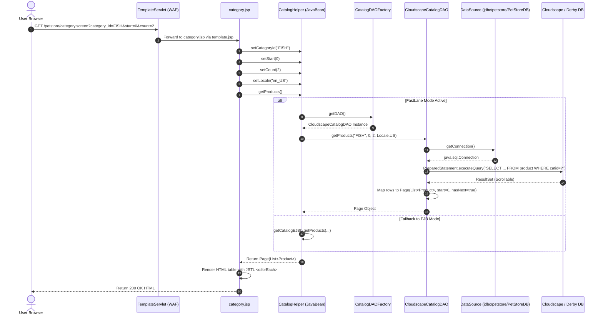
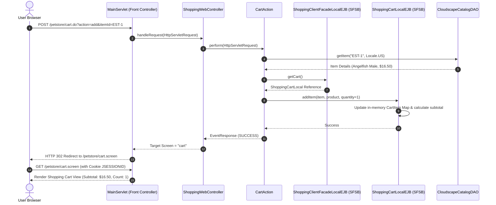
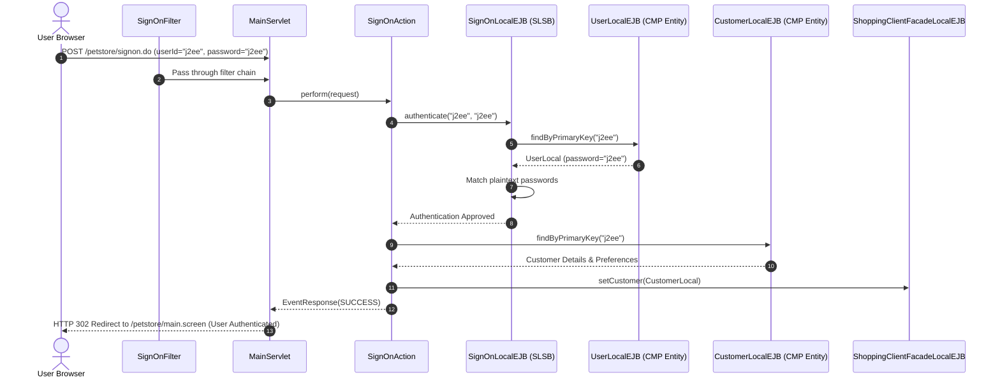
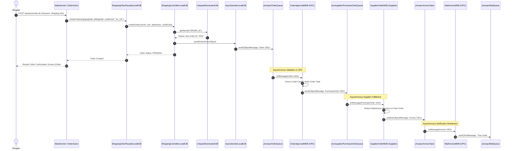

# Low-Level Design (LLD): Sequence Diagrams

This document captures the detailed chronological interaction sequence for the primary execution flows in the 2002 Java Pet Store:
1. **FastLane Catalog Browsing Flow**
2. **Shopping Cart Conversational State Flow**
3. **User Authentication & Sign-On Flow**
4. **End-to-End Asynchronous Order Placement & OPC Fulfillment Flow**

---

## 1. FastLane Catalog Browsing Sequence Diagram

Demonstrates how the presentation tier bypasses EJB entity beans to directly query the database via JDBC.

---

## 2. Shopping Cart Conversational State Sequence Diagram

Demonstrates Stateful Session Bean (`ShoppingCartLocalEJB`) state tracking across user actions.

---

## 3. User Authentication & Sign-On Sequence Diagram

Demonstrates credential verification and session association.

---

## 4. End-to-End Order Placement & Asynchronous JMS OPC Flow

Demonstrates the asynchronous messaging decoupling between Storefront, Order Processing Center (OPC), and Supplier.

