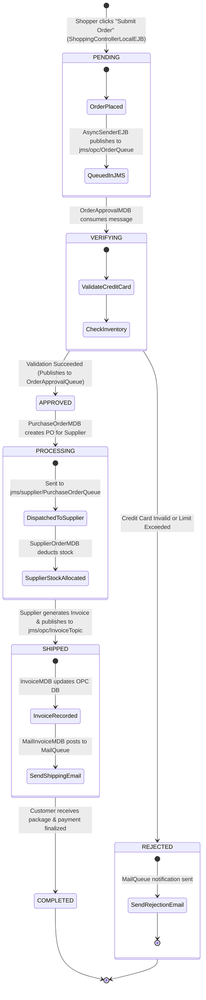
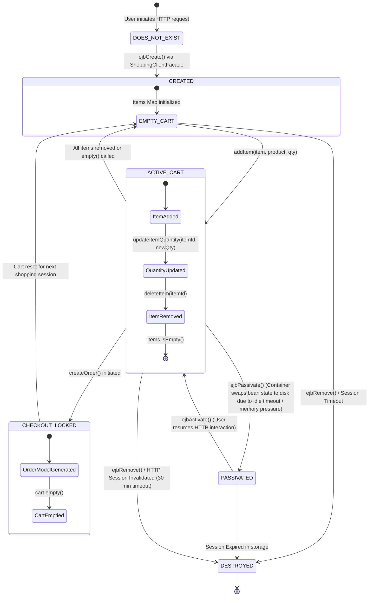
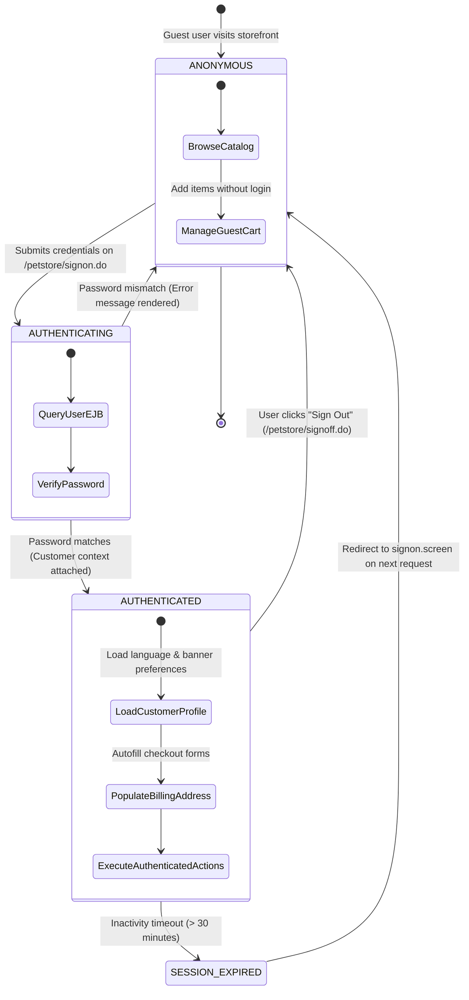

# Low-Level Design (LLD): State Machine Diagrams

This document illustrates the state transitions for the core business entities in the 2002 Java Pet Store:
1. **Purchase Order State Machine**
2. **Stateful Session Bean (SFSB) Shopping Cart Lifecycle**
3. **User Authentication & Session State Machine**

---

## 1. Purchase Order State Machine Diagram

Captures the lifecycle of an order from initial creation in the storefront, asynchronous validation in the OPC, through supplier fulfillment and final completion.

---

## 2. Stateful Session Bean (SFSB) Shopping Cart Lifecycle

Captures the container-managed lifecycle of `ShoppingCartLocalEJB` and `ShoppingClientFacadeLocalEJB` per HTTP session.

---

## 3. User Authentication & Session State Machine

