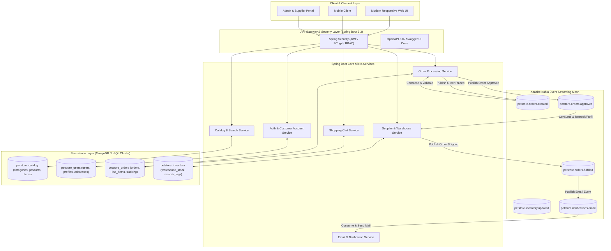

# Modernization Roadmap: Spring Boot 3.x + MongoDB + Apache Kafka

This plan outlines the complete modernization roadmap to transform the **2002 Java Pet Store (J2EE 1.3 / EJB 2.0 / Cloudscape / JMS)** into a **cloud-native, high-throughput, event-driven architecture** powered by **Spring Boot 3.3.x (Java 21 LTS)**, **MongoDB NoSQL**, and **Apache Kafka**.

---

## 🔍 Baseline Architectural Limitations Identified

From our deep analysis of the 2002 baseline source code, HLD/LLD designs, and verified runner execution, the following core limitations have been identified:

| # | Baseline Architectural Limitation | Consequence / Flaw | Target Modern Architecture |
| :- | :--- | :--- | :--- |
| **1** | **Stateful Session Beans (SFSB) in JVM Memory** | Shopping carts and user session states are pinned to server memory (`ShoppingCartLocalEJB`). Node failure causes cart loss; prevents horizontal scaling without sticky sessions. | **Stateless REST APIs + Persistent MongoDB Carts / Redis Session** with JWT authentication tokens. |
| **2** | **EJB 2.0 CMP Overhead & "FastLane" Dual-Path Anti-Pattern** | EJB entity beans were too slow for reads, forcing raw JDBC FastLane DAOs alongside EJBs, resulting in duplicate queries and split business logic. | **Unified Spring Data MongoDB Repositories** with sub-millisecond document lookups, compound indexing, and reactive pagination. |
| **3** | **Point-to-Point JMS Queues (No Log Retention / Replayability)** | JMS Queues (`OrderQueue`, `PurchaseOrderQueue`) immediately drop consumed messages. Zero ability to replay events, audit history, or scale consumer groups dynamically. | **Distributed Apache Kafka Event Streaming** with partitioned topics, log retention, consumer groups, and full event replayability. |
| **4** | **Over-Normalized Relational Tables for Document-Shaped Data** | Product catalogs and customer profiles are fragmented across 12+ SQL tables (`category_details`, `product_details`, `item_details`, `contact_info`, `address`, `credit_card`), requiring expensive multi-join queries. | **Document-Oriented MongoDB Collections** with rich embedded multilingual structures (`categories`, `products`, `users`, `orders`). |
| **5** | **Plaintext Password Storage & Lack of Security** | Passwords stored in plaintext in `UserEJBTable`; no password hashing, CSRF tokens, or modern API token authentication. | **Spring Security 6.x** with BCrypt password hashing, stateless JWT authentication, and Role-Based Access Control (RBAC). |
| **6** | **Monolithic Server-Side JSP + Custom WAF Taglibs** | Frontend and backend tightly coupled in custom WAF servlets and JSPs; impossible to build mobile apps or test UI components independently. | **RESTful API + OpenAPI 3.0 (Swagger)** with a modern, responsive decoupled frontend. |

---

## 🏛️ Target Modern Architecture Design

---

## 📋 Granular Step-by-Step Modernization Plan

### Phase 1: Environment & Project Scaffolding
- **1.1 Build Tool Setup**: Initialize a clean modern Spring Boot 3.3.x Maven project under `modernized/` with Java 21 LTS.
- **1.2 Docker Compose Infrastructure**: Create `docker-compose.yml` for local development orchestration:
  - MongoDB 7.x (with MongoDB Express UI for data inspection).
  - Apache Kafka (KRaft mode, no Zookeeper required) + Kafka UI.
- **1.3 Dependencies**: Configure `spring-boot-starter-web`, `spring-boot-starter-data-mongodb`, `spring-kafka`, `spring-boot-starter-security`, `jjwt`, `springdoc-openapi`, and `lombok`.

### Phase 2: Domain Modeling & Database Seeding
- **2.1 Document Entities**: Implement MongoDB document models (`@Document`):
  - `CategoryDocument`, `ProductDocument`, `ItemDocument` (supporting embedded multilingual titles and attributes).
  - `UserDocument` & `CustomerDocument` (with embedded Address and BCrypt password).
  - `OrderDocument` & `LineItemDocument` (with status tracking and timeline).
  - `InventoryDocument` (with warehouse SKU quantities).
- **2.2 Legacy Migration / Seeder Service**: Build an automated data importer that parses the original `Populate-UTF8.xml` and seeds all categories, products, items, and demo accounts into MongoDB on first startup.

### Phase 3: Catalog & Search REST APIs
- **3.1 Repositories & Services**: Create `CatalogRepository` with custom query methods (category listing, product by ID, item by ID, text search).
- **3.2 Controller Layer**: Implement REST endpoints:
  - `GET /api/v1/categories` (supports localization `?lang=en_US`)
  - `GET /api/v1/categories/{categoryId}/products?page=0&size=10`
  - `GET /api/v1/products/{productId}`
  - `GET /api/v1/items/{itemId}`
  - `GET /api/v1/catalog/search?q={query}`

### Phase 4: Authentication, Security & Customer Accounts
- **4.1 Spring Security Configuration**: Stateless JWT filter, password encoder (`BCryptPasswordEncoder`).
- **4.2 Auth Endpoints**:
  - `POST /api/v1/auth/signup` (user registration with validation).
  - `POST /api/v1/auth/login` (returns JWT token and user profile).
  - `GET /api/v1/auth/me` (authenticated user profile).
  - `PUT /api/v1/auth/profile` (update address, preferred language, favorite category).

### Phase 5: Shopping Cart & Order Checkout (Synchronous Core)
- **5.1 Cart Service**: Supports both guest sessions and authenticated user persistent carts in MongoDB.
  - `GET /api/v1/cart`
  - `POST /api/v1/cart/items` (add item)
  - `PUT /api/v1/cart/items/{itemId}` (update quantity)
  - `DELETE /api/v1/cart/items/{itemId}` (remove item)
  - `DELETE /api/v1/cart` (clear cart)
- **5.2 Order Placement Service**:
  - `POST /api/v1/orders` (validates cart, creates `OrderDocument` in status `PENDING`, initiates Kafka event).
  - `GET /api/v1/orders/{orderId}`
  - `GET /api/v1/orders/user` (user order history).

### Phase 6: Asynchronous Event-Driven Architecture with Apache Kafka
- **6.1 Kafka Topic Configuration**:
  - `petstore.orders.created` (3 partitions, replication factor 1 for local/dev).
  - `petstore.orders.approved`
  - `petstore.orders.fulfilled`
  - `petstore.inventory.restocked`
  - `petstore.notifications.email`
- **6.2 Producers & Consumers (MDB Modernization)**:
  - **OrderApprovalConsumer**: Consumes `orders.created`, performs automated credit check & stock verification, transitions order to `APPROVED` or `REJECTED`, publishes to `orders.approved`.
  - **SupplierFulfillmentConsumer**: Consumes `orders.approved`, adjusts warehouse stock, transitions order to `SHIPPED`, publishes to `orders.fulfilled`.
  - **EmailNotificationConsumer**: Consumes `orders.fulfilled` and `orders.created`, logs mock emails / dispatches notifications.
  - **Dead Letter Topic (DLT)**: Configured for failed event retries with exponential backoff.

### Phase 7: Supplier, Admin Portal & Observability
- **7.1 Admin REST APIs**:
  - `GET /api/v1/admin/orders` (list all orders across statuses).
  - `PUT /api/v1/admin/orders/{orderId}/status` (manual override).
  - `GET /api/v1/supplier/inventory` (view stock levels).
  - `POST /api/v1/supplier/inventory/restock` (restock SKU quantities).
- **7.2 Health & Metrics**: Spring Boot Actuator (`/actuator/health`, `/actuator/metrics`, `/actuator/prometheus`).

### Phase 8: Modern UI & End-to-End Verification
- **8.1 Modern Web Interface**: Clean, responsive UI consuming the REST APIs, featuring dynamic cart badges, instant search, language switching, and checkout flows.
- **8.2 Verification & Testing**:
  - Unit tests with Mockito & JUnit 5.
  - Integration tests with `@SpringBootTest` and Testcontainers (MongoDB & Kafka).
  - End-to-end user checkout & asynchronous order fulfillment verification.
