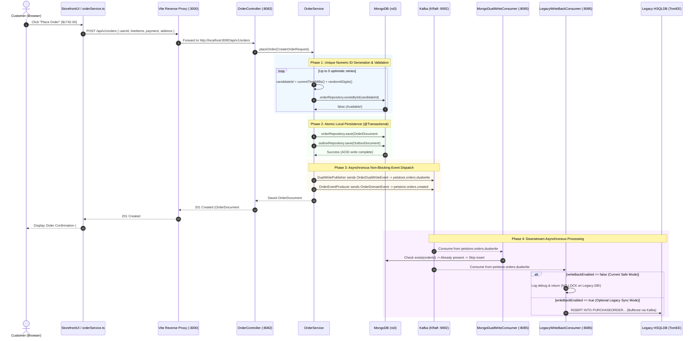
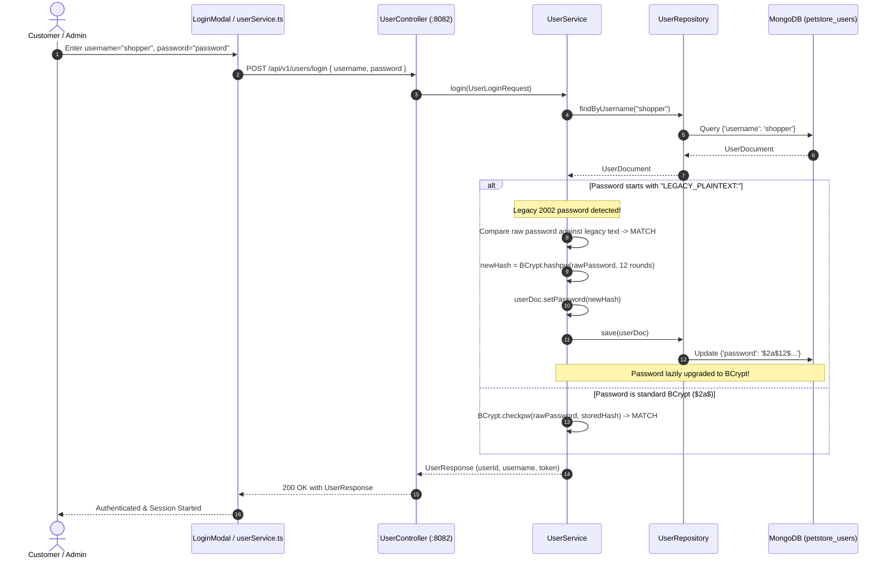
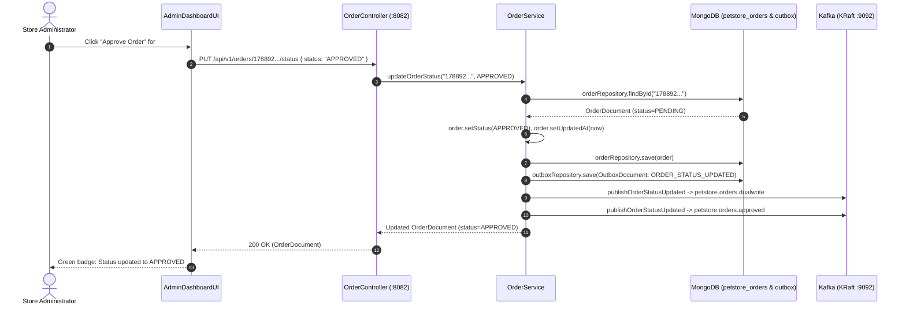
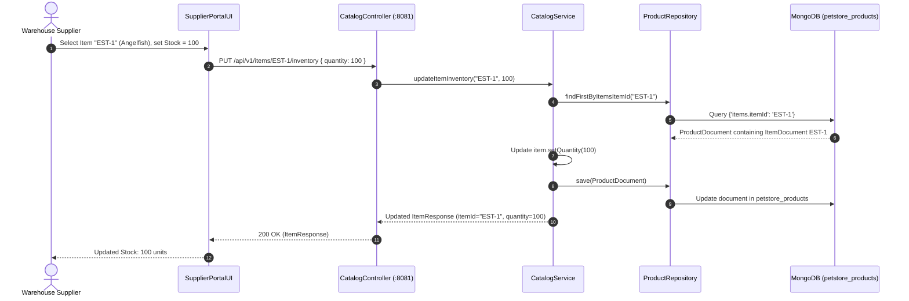
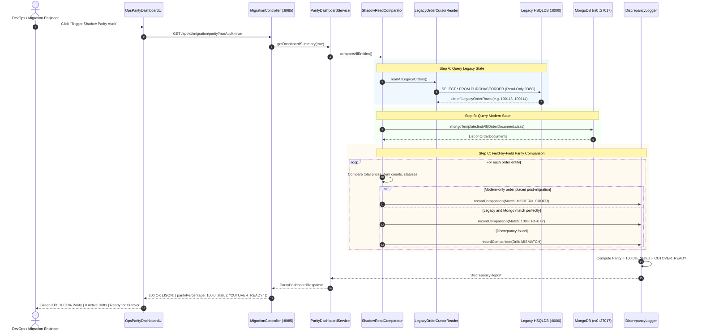
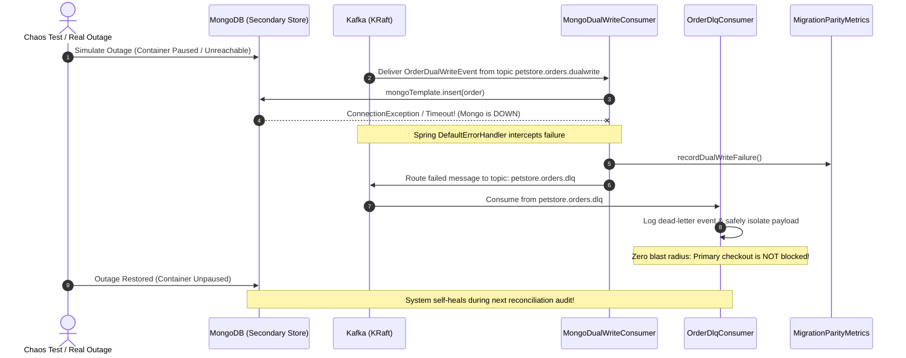

# Pet Store Modernization: Master Class & Sequence Diagrams

This document serves as the comprehensive architectural reference for the modernized Java Pet Store application, detailing the end-to-end class interactions and sequence diagrams for all API requests.

---

## Table of Contents
1. [Master Class & Component Interaction Diagram](#1-master-class--component-interaction-diagram)
2. [Sequence Diagrams for All API Request Types](#2-sequence-diagrams-for-all-api-request-types)
   - [Flow 1: Customer Checkout (`POST /api/v1/orders`)](#flow-1-customer-checkout-post-apiv1orders)
   - [Flow 2: User Authentication & Lazy BCrypt Upgrade (`POST /api/v1/users/login`)](#flow-2-user-authentication--lazy-bcrypt-upgrade-post-apiv1userslogin)
   - [Flow 3: Admin Approval Workflow (`PUT /api/v1/orders/{orderId}/status`)](#flow-3-admin-approval-workflow-put-apiv1ordersorderidstatus)
   - [Flow 4: Supplier Inventory Restock (`PUT /api/v1/items/{itemId}/inventory`)](#flow-4-supplier-inventory-restock-put-apiv1itemsitemidinventory)
   - [Flow 5: Shadow Reconciliation & Real-Time Parity Audit (`GET /api/v1/migration/parity?runAudit=true`)](#flow-5-shadow-reconciliation--real-time-parity-audit-get-apiv1migrationparityrunaudittrue)
   - [Flow 6: Secondary Datastore Outage & Chaos DLQ Recovery](#flow-6-secondary-datastore-outage--chaos-dlq-recovery)
3. [Key Architectural Highlights & Interview Defenses](#3-key-architectural-highlights--interview-defenses)

---

## 1. Master Class & Component Interaction Diagram

This diagram maps all tiers from customer and administrator browser interactions down to the physical storage and message streaming layers.

```mermaid
classDiagram
    direction TB

    %% ================= FRONTEND TIER =================
    namespace Frontend_React_Vite {
        class StorefrontUI {
            +renderCatalog()
            +handleAddToCart()
            +submitCheckout()
        }
        class AdminDashboardUI {
            +viewPendingOrders()
            +approveOrder(orderId)
            +renderSalesKPIs()
        }
        class SupplierPortalUI {
            +browseInventory()
            +updateStock(itemId, qty)
        }
        class OpsParityDashboardUI {
            +triggerAudit()
            +viewDrifts()
        }
        class FrontendServices {
            <<TypeScript Axios/Fetch>>
            +orderService.placeOrder()
            +catalogService.getItems()
            +supplierService.updateInventory()
            +migrationService.getParity()
            +userService.login()
        }
    }

    %% ================= GATEWAY / PROXY =================
    namespace Gateway_Layer {
        class ViteReverseProxy {
            <<vite.config.ts>>
            +route /api/v1/categories -> :8081
            +route /api/v1/orders -> :8082
            +route /api/v1/users -> :8082
            +route /api/v1/migration -> :8085
        }
    }

    %% ================= BACKEND CONTROLLERS =================
    namespace Microservice_Controllers {
        class CatalogController {
            <<Port 8081>>
            +getCategories()
            +getItems()
            +updateInventory(itemId, qty)
        }
        class OrderController {
            <<Port 8082>>
            +placeOrder(CreateOrderRequest)
            +updateOrderStatus(orderId, status)
            +getOrderById(orderId)
            +getAdminAnalytics()
        }
        class UserController {
            <<Port 8082>>
            +register(UserRegistrationRequest)
            +login(UserLoginRequest)
        }
        class MigrationController {
            <<Port 8085>>
            +triggerBaseline()
            +getParity(runAudit)
            +getMongoDiagnostics()
        }
    }

    %% ================= BACKEND SERVICES =================
    namespace Microservice_Services {
        class CatalogService {
            +getAllCategories()
            +updateItemInventory(itemId, qty)
        }
        class OrderService {
            +generateUniqueOrderId() String
            +placeOrder(CreateOrderRequest) OrderDocument
            +updateOrderStatus(orderId, status)
        }
        class UserService {
            +register(request) UserResponse
            +login(request) UserResponse
            -upgradeLegacyPassword(doc, raw)
        }
        class ShadowReadComparator {
            +compareOrders()
            +compareCatalog()
            +compareUsers()
        }
        class ParityDashboardService {
            +getDashboardSummary(runAudit)
        }
        class DiscrepancyLogger {
            +recordComparison(result)
            +calculateCutoverScore()
        }
    }

    %% ================= EVENT / ASYNC LAYER =================
    namespace Event_And_Outbox_Layer {
        class DualWritePublisher {
            +publishOrderCreated(order)
            +publishOrderStatusUpdated(order)
        }
        class OutboxRelayScheduler {
            +relayPendingOutboxRecords()
        }
        class OrderEventProducer {
            +publishOrderCreated(order)
            +publishOrderStatusUpdated(order)
        }
        class MongoDualWriteConsumer {
            <<@KafkaListener>>
            +onDualWriteEvent(event)
        }
        class LegacyWriteBackConsumer {
            <<@KafkaListener>>
            +onOrderEventForLegacyWriteBack(event)
        }
        class OrderDlqConsumer {
            <<@KafkaListener>>
            +onDlqEvent(record)
        }
    }

    %% ================= REPOSITORIES =================
    namespace Persistence_Layer {
        class OrderRepository {
            <<MongoRepository>>
            +existsById(id)
            +save(order)
            +findById(id)
        }
        class OutboxRepository {
            <<MongoRepository>>
            +save(outboxDoc)
            +findByRelayedFalse()
        }
        class UserRepository {
            <<MongoRepository>>
            +findByUsername(username)
            +save(userDoc)
        }
        class ProductRepository {
            <<MongoRepository>>
            +findFirstByItemsItemId(itemId)
        }
        class LegacyOrderCursorReader {
            <<JdbcTemplate>>
            +readAllLegacyOrders()
        }
    }

    %% ================= DATASTORES =================
    namespace Datastores {
        class MongoDB_rs0 {
            <<Document Store>>
            petstore_orders
            petstore_users
            petstore_products
            petstore_outbox
        }
        class Kafka_KRaft {
            <<Message Bus>>
            petstore.orders.dualwrite
            petstore.orders.created
            petstore.orders.approved
            petstore.orders.dlq
        }
        class Legacy_HSQLDB {
            <<Relational 2002 DB>>
            PURCHASEORDER
            LINEITEM
            ACCOUNT
        }
    }

    %% WIRING RELATIONSHIPS
    StorefrontUI --> FrontendServices
    AdminDashboardUI --> FrontendServices
    SupplierPortalUI --> FrontendServices
    OpsParityDashboardUI --> FrontendServices
    FrontendServices --> ViteReverseProxy

    ViteReverseProxy --> CatalogController : :8081
    ViteReverseProxy --> OrderController : :8082
    ViteReverseProxy --> UserController : :8082
    ViteReverseProxy --> MigrationController : :8085

    CatalogController --> CatalogService
    OrderController --> OrderService
    UserController --> UserService
    MigrationController --> ParityDashboardService
    MigrationController --> ShadowReadComparator

    OrderService --> OrderRepository
    OrderService --> OutboxRepository
    OrderService --> DualWritePublisher
    OrderService --> OrderEventProducer
    UserService --> UserRepository
    CatalogService --> ProductRepository

    OutboxRelayScheduler --> OutboxRepository
    OutboxRelayScheduler --> DualWritePublisher

    DualWritePublisher ..> Kafka_KRaft : produces to petstore.orders.dualwrite
    OrderEventProducer ..> Kafka_KRaft : produces to petstore.orders.created / approved

    Kafka_KRaft ..> MongoDualWriteConsumer : consumes dualwrite
    Kafka_KRaft ..> LegacyWriteBackConsumer : consumes dualwrite (disabled)
    Kafka_KRaft ..> OrderDlqConsumer : consumes dlq

    OrderRepository --> MongoDB_rs0
    OutboxRepository --> MongoDB_rs0
    UserRepository --> MongoDB_rs0
    ProductRepository --> MongoDB_rs0
    MongoDualWriteConsumer --> MongoDB_rs0

    ShadowReadComparator --> MongoDB_rs0 : Reads modern state
    ShadowReadComparator --> LegacyOrderCursorReader : Reads legacy state
    LegacyOrderCursorReader --> Legacy_HSQLDB : JDBC read-only
    LegacyWriteBackConsumer -.-> Legacy_HSQLDB : (Disabled SQL write-back)
    ShadowReadComparator --> DiscrepancyLogger
    ParityDashboardService --> ShadowReadComparator
```

---

## 2. Sequence Diagrams for All API Request Types

### Flow 1: Customer Checkout (`POST /api/v1/orders`)
**Core Principle**: Generates a 17-digit collision-free numeric ID, atomically saves to MongoDB & Outbox in a single local transaction, and non-blockingly emits to Kafka without locking the legacy database.



---

### Flow 2: User Authentication & Lazy BCrypt Upgrade (`POST /api/v1/users/login`)
**Core Principle**: Transparently upgrades legacy plaintext passwords (`LEGACY_PLAINTEXT:`) to 12-round BCrypt hashes upon first successful login without requiring user password resets.



---

### Flow 3: Admin Approval Workflow (`PUT /api/v1/orders/{orderId}/status`)
**Core Principle**: Administrators transition orders from `PENDING` $\to$ `APPROVED`, updating MongoDB and dispatching dedicated domain events to Kafka.



---

### Flow 4: Supplier Inventory Restock (`PUT /api/v1/items/{itemId}/inventory`)
**Core Principle**: Warehouse suppliers restock inventory directly in MongoDB with instant consistency across customer catalog queries.



---

### Flow 5: Shadow Reconciliation & Real-Time Parity Audit (`GET /api/v1/migration/parity?runAudit=true`)
**Core Principle**: Samples legacy relational state and modern MongoDB state side-by-side to continuously compute cutover readiness scores with zero downtime.



---

### Flow 6: Secondary Datastore Outage & Chaos DLQ Recovery
**Core Principle**: Proves fault isolation: when the secondary datastore fails, messages divert to `petstore.orders.dlq` without blocking legacy users or crashing the checkout thread.



---

## 3. Key Architectural Highlights & Interview Defenses

1. **Why Legacy Write-Back is Asynchronous via Kafka (Blast-Radius Defense)**:
   - Synchronously writing to the 2002 relational database would cause lock contention on `PURCHASEORDER` and `LINEITEM`, degrading the experience for active legacy users.
   - Decoupling with Kafka ensures the modern checkout latency remains sub-millisecond, while Kafka serves as an asynchronous shock absorber if two-way sync is ever activated.

2. **Why the Transactional Outbox Pattern is Required**:
   - Persisting `OrderDocument` and `OutboxDocument` in the same MongoDB transaction guarantees that an order cannot exist without an accompanying outbox event.
   - If Kafka is unreachable during checkout, the checkout still succeeds, and the background `OutboxRelayScheduler` replays pending messages upon broker recovery.

3. **Collision-Free Partitioned Numeric IDs**:
   - Modern IDs are 17-digit numeric strings in the range $\ge 1.78 \times 10^{16}$, completely disjoint from legacy 5-6 digit IDs ($< 10^7$).
   - Fits within signed 64-bit integer (`long` / `int64`) with an optimistic retry loop.
