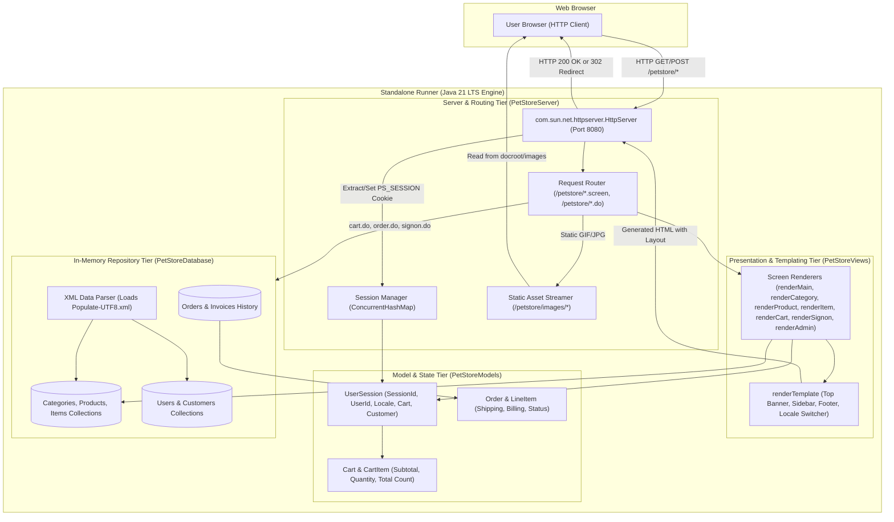
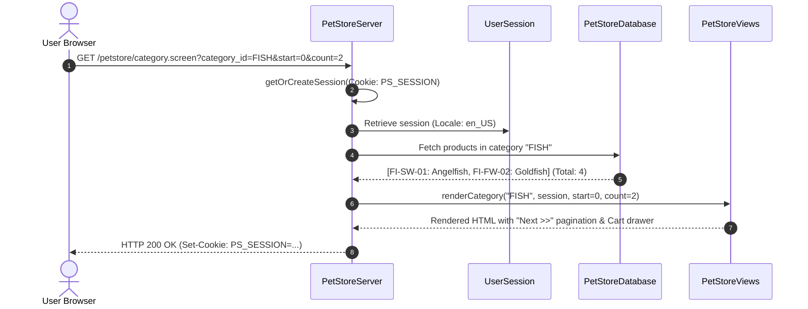

# Pet Store Native Runner: Architecture & Design

> [!NOTE]
> **Purpose**: The `runner/` module provides a **zero-dependency, native Java 21 LTS simulation engine** for the 2002 Java Pet Store. It allows developers and architects to run and inspect the complete legacy UI, catalog hierarchy, conversational shopping cart, customer accounts, and administrative workflows on modern macOS without requiring a heavy 2002 J2EE 1.3.1 container or modifying any original source files in `src/`.

---

## 1. High-Level Runner Architecture Diagram

The runner emulates all layers of the 2002 multi-tier J2EE blueprint inside a lightweight, standalone Java runtime:

---

## 2. Component Breakdown

### 2.1 `PetStoreServer.java` (HTTP Controller & Dispatcher)
- **Embedded Web Server**: Uses `com.sun.net.httpserver.HttpServer` listening on `http://localhost:8080`.
- **Session Tracking**: Maintains conversational session state via `ConcurrentHashMap<String, UserSession>`. Session IDs are transmitted in the standard `PS_SESSION` HTTP cookie and attached to all 200 OK responses and 302 redirects.
- **Action Processing**: Dispatches POST actions (`/petstore/cart.do`, `/petstore/order.do`, `/petstore/signon.do`, `/petstore/changelocale.do`) and redirects the user to the corresponding `.screen` view.
- **Static Assets**: Streams images directly from `src/apps/petstore/src/docroot/images/` with proper MIME headers (`image/gif`, `image/jpeg`).

### 2.2 `PetStoreDatabase.java` (Data Layer Simulation)
- **Singleton In-Memory Datastore**: Emulates `PetStoreDB`, `OPCDB`, and `SupplierDB`.
- **XML Seeding**: Parses `src/apps/petstore/src/docroot/populate/Populate-UTF8.xml` on server boot to load all 5 pet categories (`FISH`, `DOGS`, `REPTILES`, `CATS`, `BIRDS`), 16 products, 28 items, and default users (`j2ee`, `shopper`).

### 2.3 `PetStoreModels.java` (Domain Entities)
- Contains clean, POJO data structures for `Category`, `Product`, `Item`, `Cart`, `CartItem`, `Customer`, `Address`, `CreditCard`, and `Order`.
- Includes localized getters (`getName(locale)`, `getDescription(locale)`) supporting English (`en_US`), Japanese (`ja_JP`), and Chinese (`zh_CN`).

### 2.4 `PetStoreViews.java` (HTML Template Engine)
- Emulates the original Sun WAF `template.jsp` layout:
  - **Top Banner**: Search bar, account status, cart badge counter, sign-in/out, and language flag selectors.
  - **Left Sidebar**: Categories with icons and active category selection.
  - **Main Body**: Dynamic content for categories (with 2-item pagination), product tables, item details, and checkout forms.
  - **Right Sidebar (MyList)**: Live shopping cart drawer showing items and running subtotal.
  - **Footer**: Authentic BluePrints copyright and metadata.

---

## 3. Request-Response Lifecycle Flow

---

## 4. Comparison: Legacy J2EE vs Runner vs Phase 2 Spring Boot

| Capability | 2002 J2EE 1.3 Baseline | Standalone Runner (`runner/`) | Phase 2 Modernized (Spring Boot) |
| :--- | :--- | :--- | :--- |
| **Runtime** | Sun JDK 1.3 / OpenEJB 4 (JDK 8) | Java 21 LTS | Java 21 LTS |
| **Framework** | Custom WAF + EJB 2.0 CMP/BMP | Lightweight Embedded HttpServer | Spring Boot 3.3.x + Spring MVC / REST |
| **State Tracking** | Stateful Session Beans (SFSB) | In-Memory `UserSession` Cookie | Spring Session / Stateless JWT + Redis |
| **Database** | Cloudscape / Derby Relational | In-Memory Object Repositories | MongoDB NoSQL Document Collections |
| **Asynchronous Events**| JMS Queues (`OrderQueue`) | In-Memory Event Dispatcher | Apache Kafka Event Streaming Topics |
| **Build & Run** | Ant + EAR Packaging (`setup.xml`) | `bash ./run.sh` | `mvn spring-boot:run` / Docker Compose |
