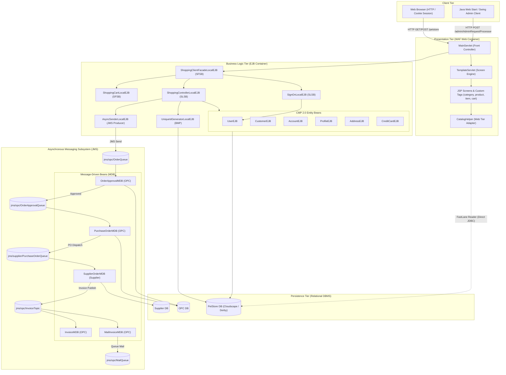
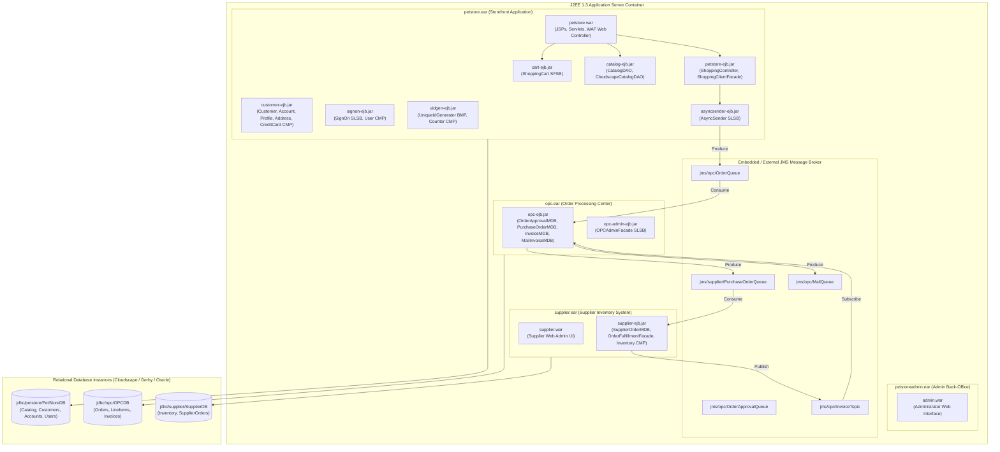
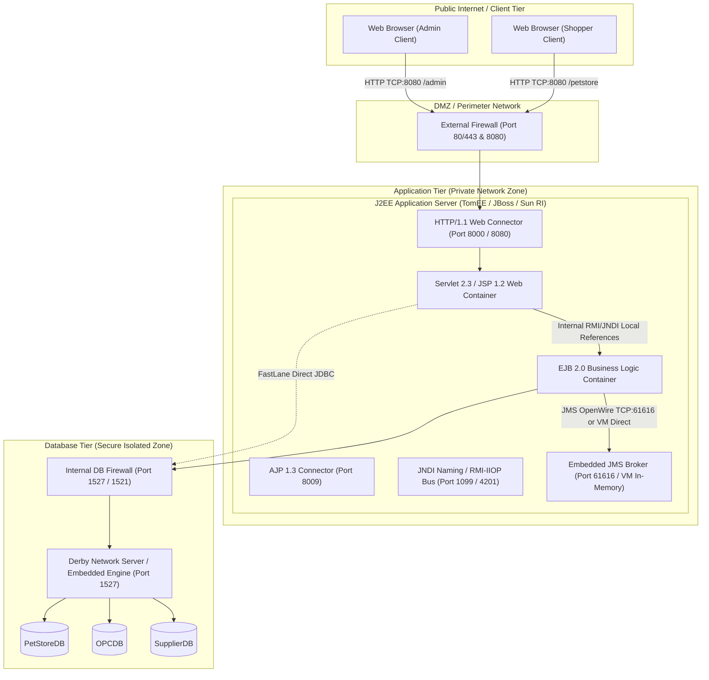
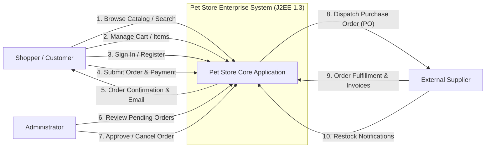
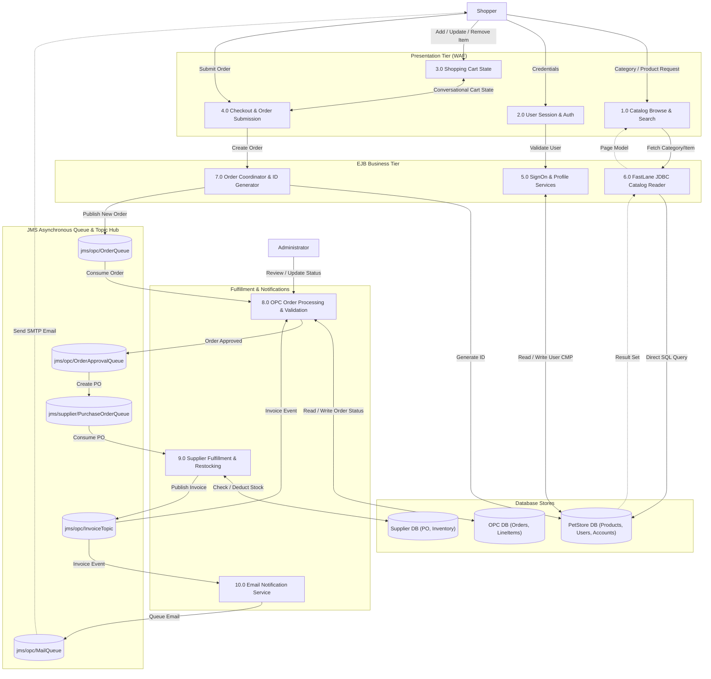
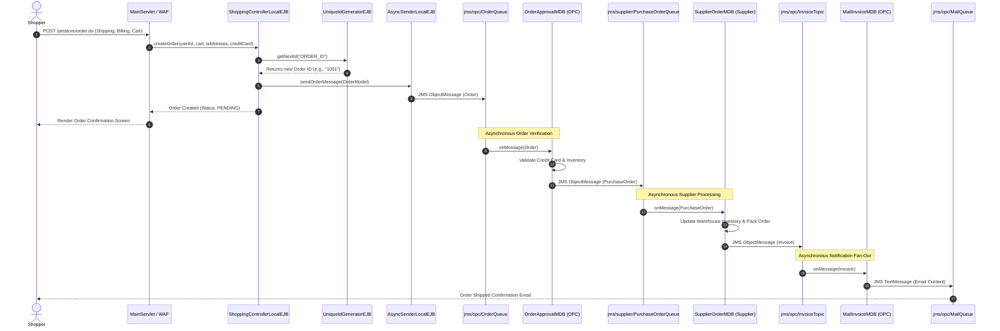

# Legacy Pet Store (2002) - High-Level Design (HLD)

> **Heritage Context**: This document details the high-level architecture, deployment topology, network boundaries, and data flow pipelines of the **Sun Microsystems Java Pet Store Demo 1.3.1_02 (circa 2002)**, built as the official enterprise reference blueprint for **J2EE 1.3**.

---

## 1. Executive System Architecture

The 2002 Java Pet Store is decomposed into four decoupled enterprise applications adhering to the multi-tier J2EE BluePrints pattern:
1. **PetStore Web & Storefront (`petstore.ear`)**: E-commerce customer storefront for browsing pet categories, managing conversational shopping carts, user authentication, and placing orders.
2. **Order Processing Center - OPC (`opc.ear`)**: Enterprise integration hub managing asynchronous order validation, credit approval, supplier procurement, and email notification via JMS Message-Driven Beans (MDBs).
3. **Supplier Subsystem (`supplier.ear`)**: Independent supply-chain fulfillment and inventory tracking system.
4. **PetStore Administrator (`petstoreadmin.ear`)**: Administrative back-office client for managing orders and inventory status.

---

## 2. Enterprise Application Packaging & Deployment Topology

The application is deployed across four `.ear` archives within a certified **J2EE 1.3 Container** (Apache TomEE Plus / JBoss):

### 2.1 Web Tier Modules (WAR)
| Archive | Context Root | Description & Key Servlets |
| :--- | :--- | :--- |
| `petstore.war` | `/petstore` | Main customer-facing storefront. Contains `MainServlet` (Front Controller), `TemplateServlet` (Layout Engine), `PopulateServlet` (Database Seeder), and standard JSTL taglibs. |
| `supplier.war` | `/supplier` | Supply-chain partner portal for checking inventory stock levels and manually triggering re-stocks. |
| `admin.war` | `/admin` | Store administrator dashboard for viewing orders, approving pending purchases, and tracking status. |

### 2.2 Enterprise JavaBean Modules (EJB-JAR)
| EJB JAR | EJB Name | Type | Purpose |
| :--- | :--- | :--- | :--- |
| `petstore-ejb.jar` | `ShoppingControllerEJB` | Stateless Session (SLSB) | Manages order creation, customer checkout transaction coordination. |
| `petstore-ejb.jar` | `ShoppingClientFacadeEJB` | Stateful Session (SFSB) | Conversational facade for an active customer browsing and purchasing. |
| `cart-ejb.jar` | `ShoppingCartEJB` | Stateful Session (SFSB) | Manages in-memory shopping cart items and subtotals. |
| `signon-ejb.jar` | `SignOnEJB` | Stateless Session (SLSB) | Handles password verification and authentication. |
| `signon-ejb.jar` | `UserEJB` | Entity Bean (CMP 2.0) | Stores username and password credentials. |
| `customer-ejb.jar` | `CustomerEJB` | Entity Bean (CMP 2.0) | Manages customer identity and preferences. |
| `customer-ejb.jar` | `AccountEJB` | Entity Bean (CMP 2.0) | Contains contact info, billing info, and credit card relationships. |
| `uidgen-ejb.jar` | `UniqueIdGeneratorEJB` | Entity Bean (BMP) | Generates monotonic unique ID sequences using transactional block allocation. |
| `asyncsender-ejb.jar` | `AsyncSenderEJB` | Stateless Session (SLSB) | JMS message publisher for order events. |
| `opc-ejb.jar` | `OrderApprovalMDB` | Message-Driven (MDB) | Consumes `OrderQueue`, validates order limits. |
| `opc-ejb.jar` | `PurchaseOrderMDB` | Message-Driven (MDB) | Consumes approved orders, issues PO messages to suppliers. |
| `opc-ejb.jar` | `InvoiceMDB` | Message-Driven (MDB) | Consumes invoices published by suppliers. |
| `opc-ejb.jar` | `MailInvoiceMDB` | Message-Driven (MDB) | Consumes invoices, formats confirmation emails for `MailQueue`. |
| `supplier-ejb.jar` | `SupplierOrderMDB` | Message-Driven (MDB) | Consumes `PurchaseOrderQueue`, adjusts inventory stock. |
| `supplier-ejb.jar` | `InventoryEJB` | Entity Bean (CMP 2.0) | Represents warehouse stock counts per item. |

### 2.3 JMS Destination Registry
| Destination Name | JNDI Lookup Name | Type | Producers | Consumers |
| :--- | :--- | :--- | :--- | :--- |
| `OrderQueue` | `jms/opc/OrderQueue` | Queue (P2P) | `AsyncSenderEJB` | `OrderApprovalMDB` |
| `OrderApprovalQueue` | `jms/opc/OrderApprovalQueue` | Queue (P2P) | `OrderApprovalMDB` | `PurchaseOrderMDB` |
| `PurchaseOrderQueue` | `jms/supplier/PurchaseOrderQueue` | Queue (P2P) | `PurchaseOrderMDB` | `SupplierOrderMDB` |
| `InvoiceTopic` | `jms/opc/InvoiceTopic` | Topic (Pub/Sub)| `SupplierOrderMDB` | `InvoiceMDB`, `MailInvoiceMDB` |
| `MailQueue` | `jms/opc/MailQueue` | Queue (P2P) | `MailInvoiceMDB` | `MailerService` (SMTP) |

---

## 3. Network Topology & Port Registry

| Protocol | Default Port | Source | Destination | Purpose |
| :--- | :--- | :--- | :--- | :--- |
| **HTTP 1.1** | `8000` / `8080` | Web Browser / Clients | Application Server | Storefront navigation, cart updates, JSP templates, image downloads. |
| **AJP 1.3** | `8009` | Apache Web Server / Mod_JK | Application Server | Reverse proxy routing for production J2EE deployments. |
| **RMI-IIOP** | `1099` / `4201` | Web Container / Client | EJB Container | Remote Enterprise JavaBean method invocations and JNDI context lookups. |
| **JMS (OpenWire)** | `61616` / `vm://` | AsyncSenderEJB / MDBs | ActiveMQ Broker | Asynchronous queue and topic message delivery for orders, invoices, and email. |
| **JDBC** | `1527` (Derby) / `1521` (Oracle) | EJB Container / FastLane DAO | Database Engine | Relational persistence, transactions, and data seeding. |

---

## 4. Data Flow Diagrams (DFD)

### 4.1 DFD Level 0: System Context Diagram

### 4.2 DFD Level 1: Subsystem Data Flow

### 4.3 DFD Level 2: Detailed Asynchronous Order Lifecycle

