# Legacy Pet Store (2002) - Low-Level Design (LLD)

> **Heritage Context**: This document details the micro-architectural design of the 2002 Sun Microsystems Java Pet Store v1.3.1_02, covering class hierarchies, sequence execution flows, physical relational ER schemas, state machines, and key algorithmic flowcharts.

---

## 1. Class Diagrams

### 1.1 Web Application Framework (WAF) Presentation Tier

The Web Application Framework (WAF) implements the Model-View-Controller (MVC) pattern for Servlet 2.3 and JSP 1.2.

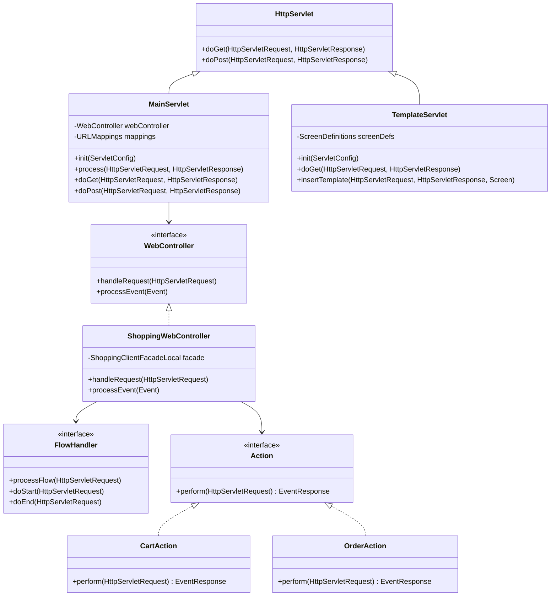

### 1.2 Session Facade & Business Tier

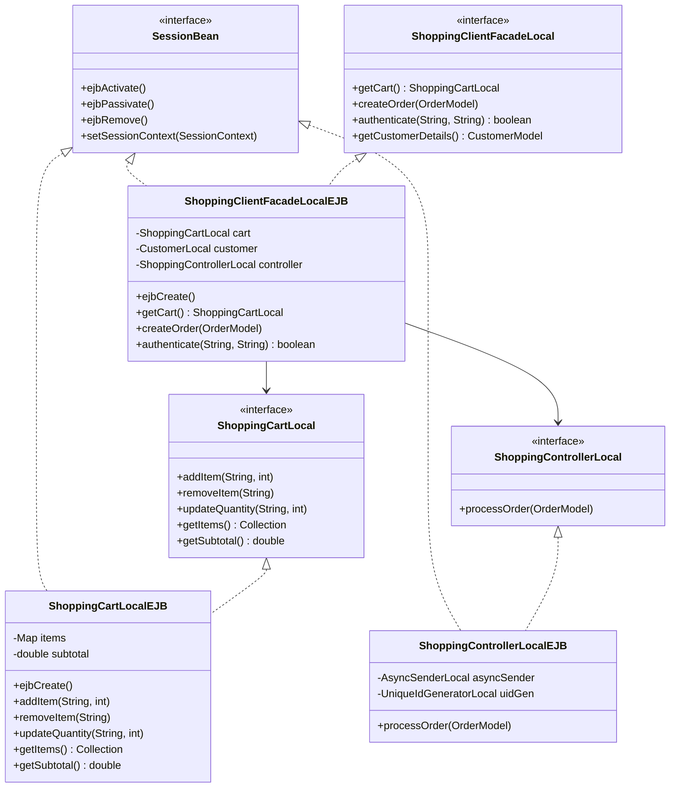

### 1.3 FastLane Reader Catalog DAO Tier

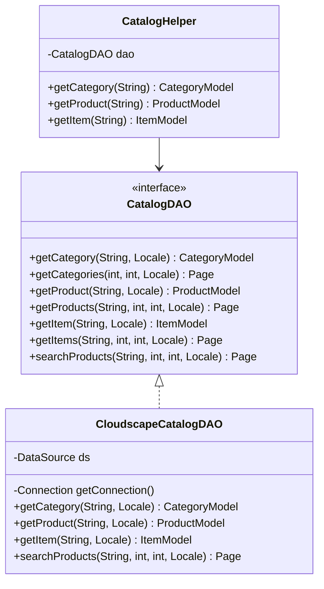

### 1.4 CMP 2.0 Entity Bean Tier

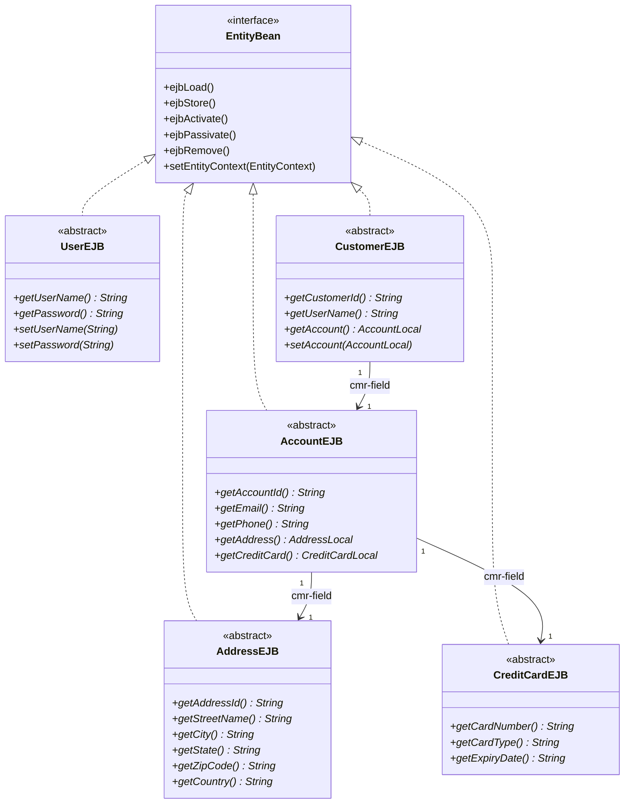

---

## 2. Sequence Diagrams

### 2.1 FastLane Catalog Browsing Flow

Demonstrates the bypass of EJB container overhead for high-performance read-only queries:

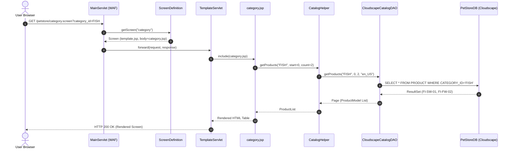

### 2.2 Conversational Shopping Cart Flow

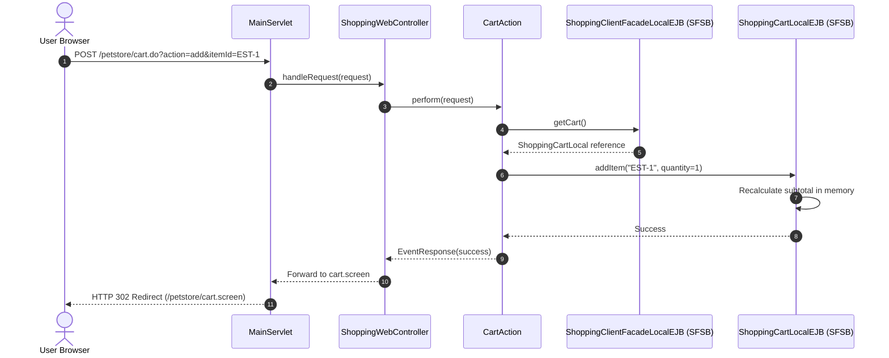

### 2.3 User Authentication & SignOn Flow

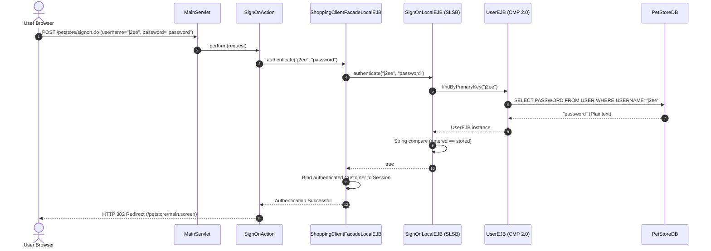

### 2.4 Asynchronous Order Fulfillment Flow

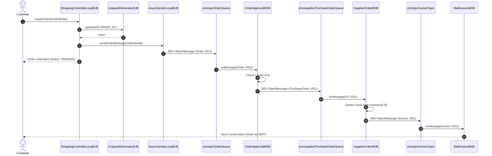

---

## 3. Relational Entity-Relationship (ER) Diagrams

The legacy architecture fragments data across three separate databases in 3NF normalized schema:

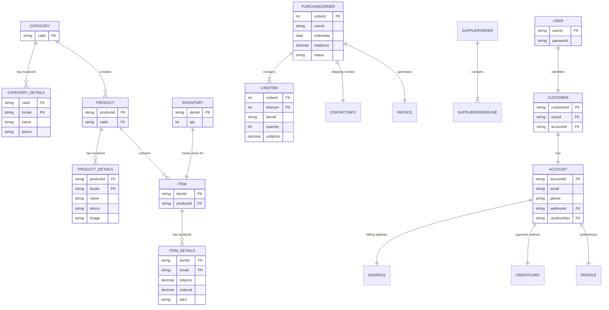

---

## 4. State Machine Diagrams

### 4.1 Purchase Order State Machine

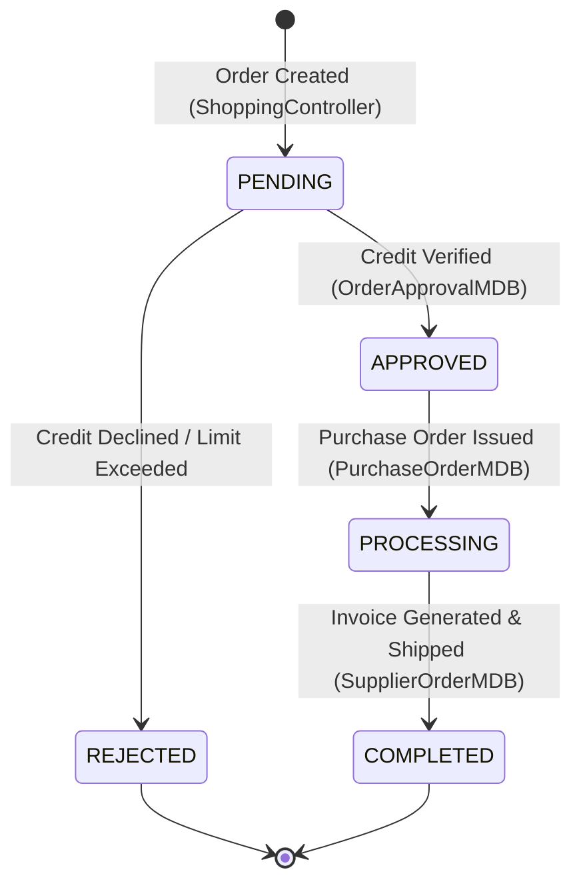

### 4.2 Stateful Session Bean (SFSB) Shopping Cart Lifecycle

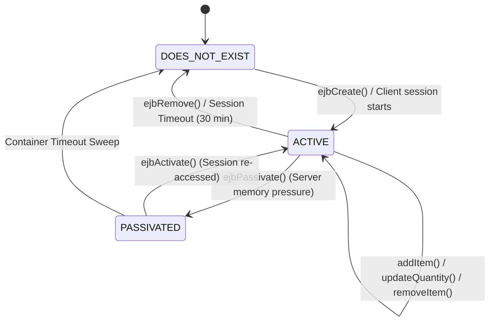

---

## 5. Algorithmic Flowcharts & Pseudocode

### 5.1 WAF Front Controller Request Processing Algorithm

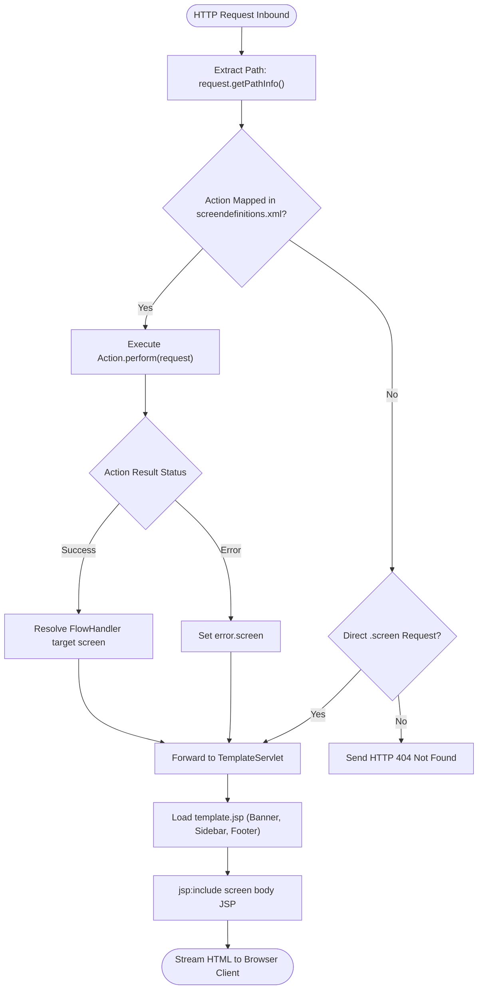

### 5.2 Unique ID Generation Algorithm (Block Allocation)

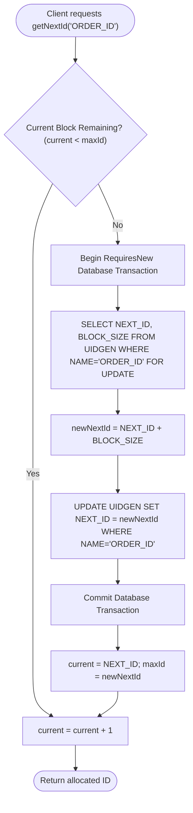
