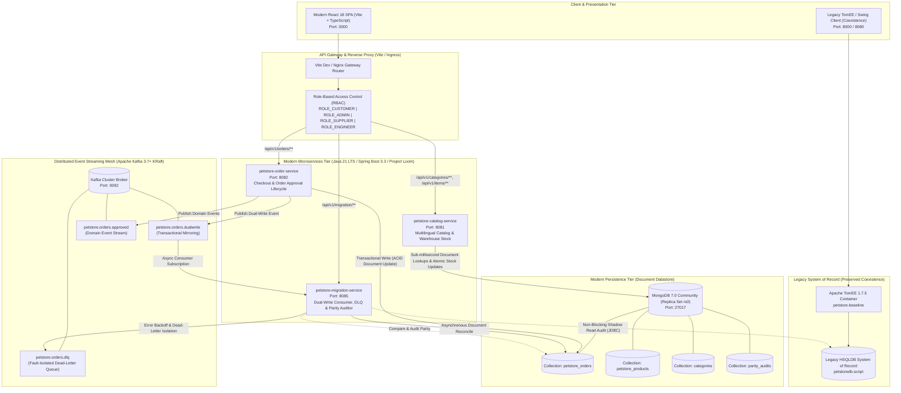
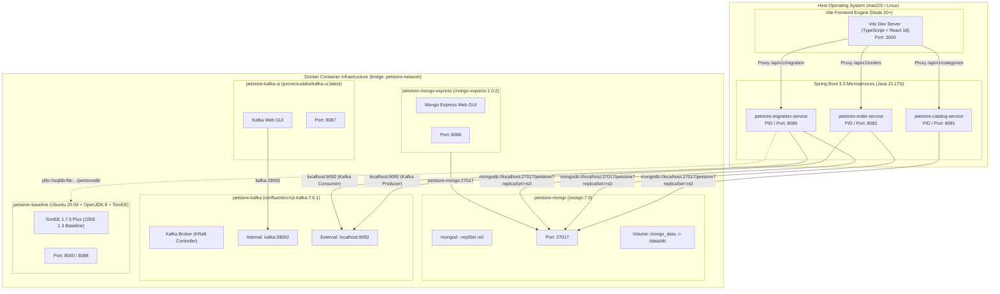
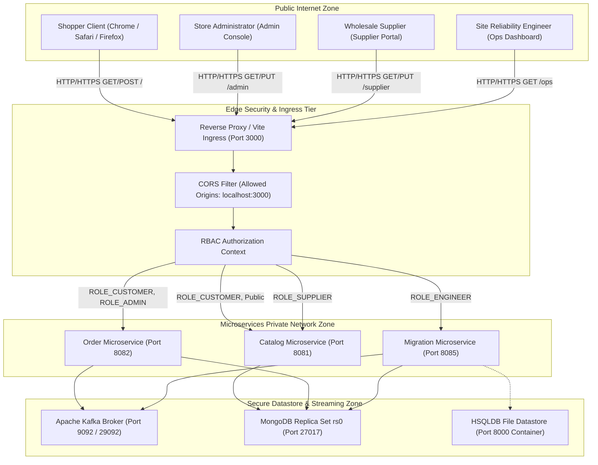
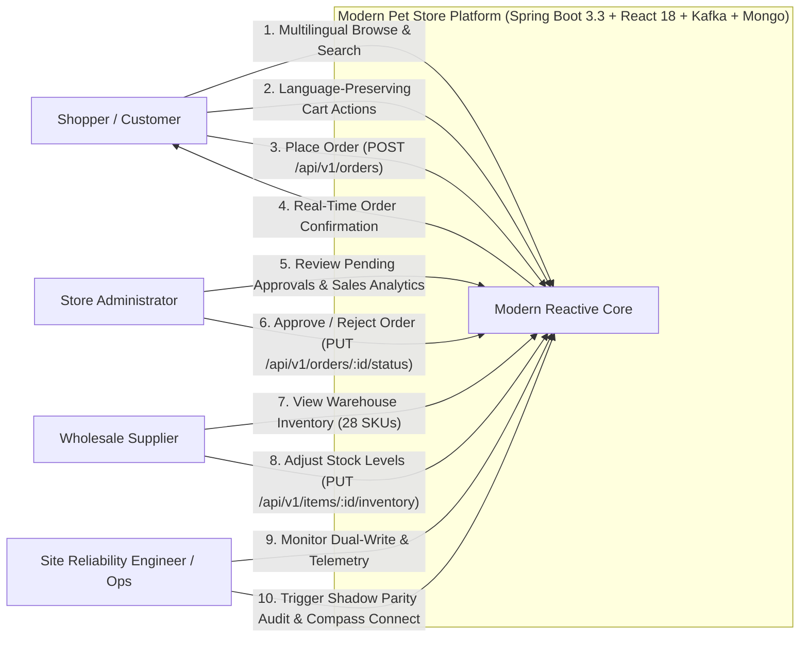
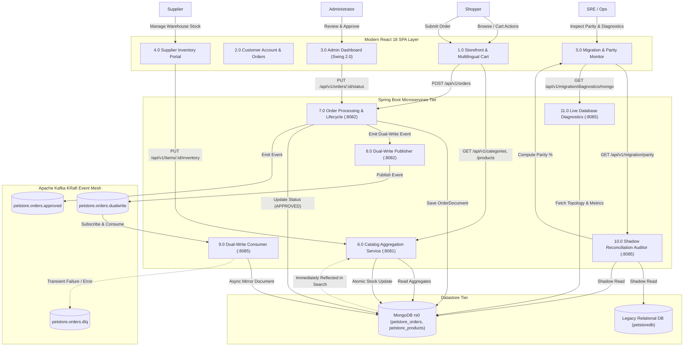

# Modern Pet Store Platform - High-Level Design (HLD)

> **Modernization Context**: This document details the high-level architecture, deployment topology, network boundaries, and data flow pipelines of the **migrated modern cloud-native Pet Store platform**, powered by **Java 21 LTS**, **Spring Boot 3.3.x**, **MongoDB 7.0 (Replica Set `rs0`)**, **Apache Kafka (KRaft mode)**, and **React 18 + Vite + TypeScript**.

---

## 1. Executive System Architecture

The modernized system departs from the 2002 monolithic EJB architecture by adopting a **reactive, event-driven microservices architecture** governed by the **Strangler Fig Application Pattern** and the **Dual-Write & Shadow Reconciliation Pattern**:

---

## 2. Deployment Topology Diagram

The platform is containerized using Docker and Docker Compose, establishing clean process boundaries, port assignments, and shared bridge networking:

### 2.1 Service Directory & Port Mapping
| Service / Container | Base Image / Technology | Host Port | Internal Network Port | Responsibilities |
| :--- | :--- | :--- | :--- | :--- |
| **`petstore-frontend`** | React 18, Vite 5.4, TypeScript | `3000` | N/A | Single-Page Application: Storefront, Account, Admin, Supplier, Ops. |
| **`petstore-catalog-service`** | Spring Boot 3.3, Java 21 LTS | `8081` | N/A | REST endpoints for Categories, Products, Items, and Supplier inventory updates. |
| **`petstore-order-service`** | Spring Boot 3.3, Java 21 LTS | `8082` | N/A | Customer checkout, order approval lifecycle, dual-write Kafka producer. |
| **`petstore-migration-service`**| Spring Boot 3.3, Java 21 LTS | `8085` | N/A | Dual-write Kafka consumer, DLQ error handler, live shadow parity auditor. |
| **`petstore-mongo`** | MongoDB 7.0 Community (rs0) | `27017` | `27017` | High-throughput document persistence (`petstore_orders`, `petstore_products`). |
| **`petstore-kafka`** | Confluent Kafka 7.6.1 (KRaft) | `9092` | `29092` | Distributed event streaming bus (`orders.dualwrite`, `orders.approved`, `orders.dlq`). |
| **`petstore-kafka-ui`** | Provectus Labs Kafka-UI | `8087` | `8080` | Web administration for Kafka topics, offsets, and consumer group lags. |
| **`petstore-mongo-express`**| Mongo Express 1.0.2 | `8086` | `8081` | Web database administration interface for MongoDB collections. |
| **`petstore-baseline`** | Apache TomEE Plus 1.7.5 | `8000` | `8088` | Preserved 2002 J2EE baseline container executing legacy EAR archives. |

---

## 3. Network Topology & Security Boundary Diagram

---

## 4. Data Flow Diagrams (DFD)

### 4.1 DFD Level 0: System Context Diagram

### 4.2 DFD Level 1: Subsystem Data Flow

