# Modern Pet Store Platform - Low-Level Design (LLD)

> **Modernization Context**: This document details the micro-architectural design of the modernized Spring Boot 3.3.x, React 18, Apache Kafka, and MongoDB architecture. It covers class hierarchies, sequence execution flows, MongoDB BSON schemas, state machine transitions, and algorithmic flowcharts.

---

## 1. Microservice Class & Component Diagrams

### 1.1 Catalog Microservice (`petstore-catalog-service`)

Manages the pet catalog aggregates, localized multilingual descriptions, and real-time inventory levels:

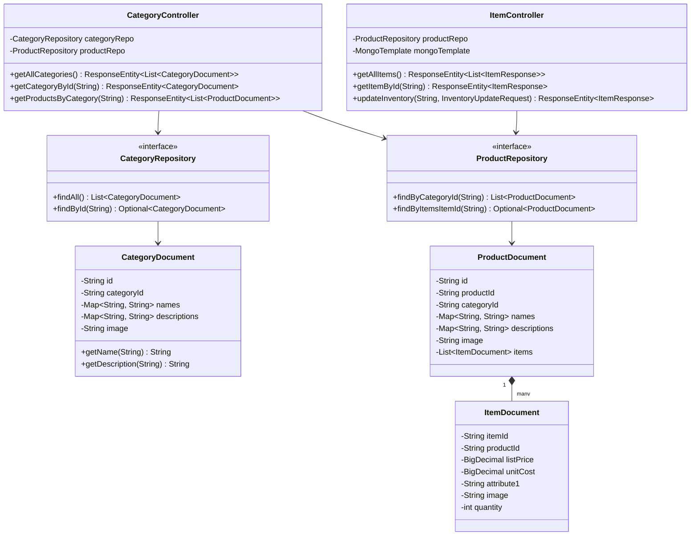

### 1.2 Order Microservice (`petstore-order-service`)

Coordinates customer checkout, atomic MongoDB persistence, order approvals, and Kafka event publishing:

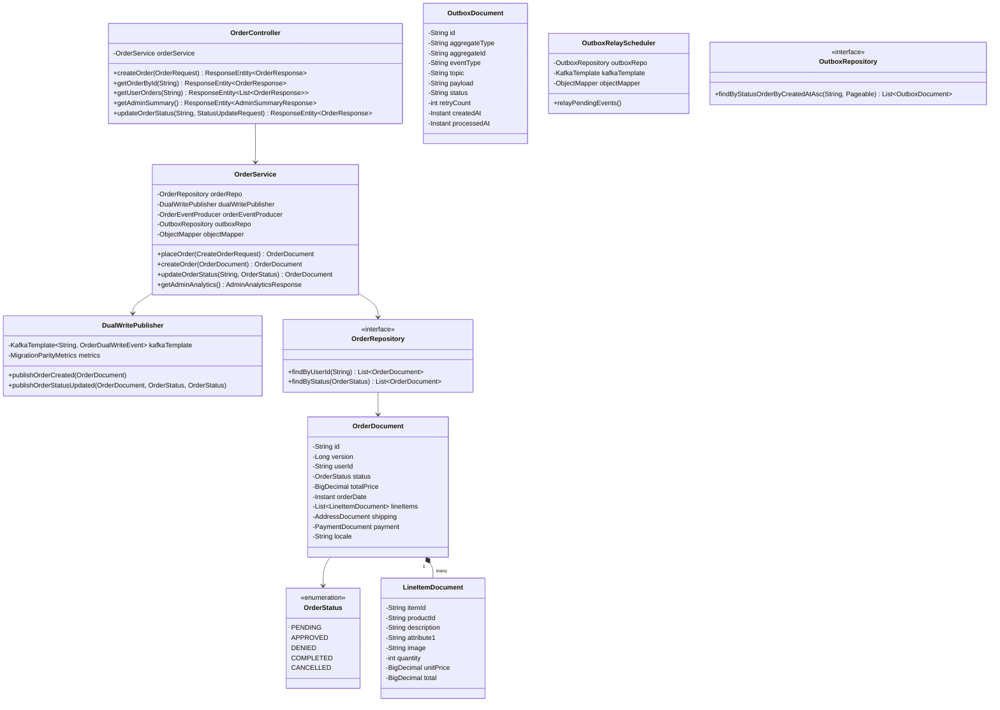

### 1.3 Migration & Parity Microservice (`petstore-migration-service`)

Consumes dual-write events from Kafka, manages Dead-Letter Queues (DLQ), and executes real-time shadow audits:

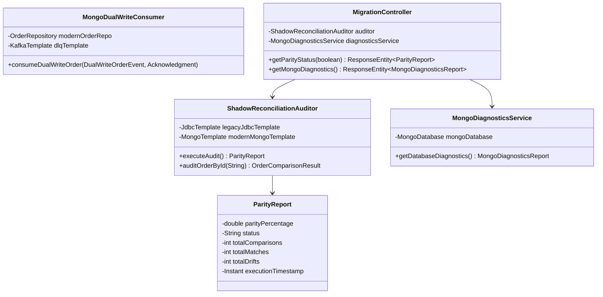

### 1.4 Modern React 18 Frontend Architecture

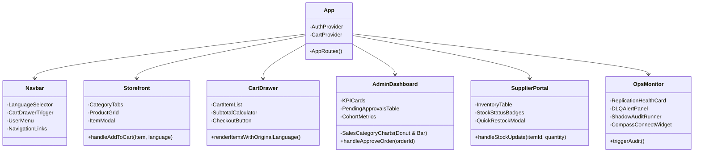

---

## 2. Sequence Execution Diagrams

### 2.1 Customer Checkout & Kafka Dual-Write Sequence

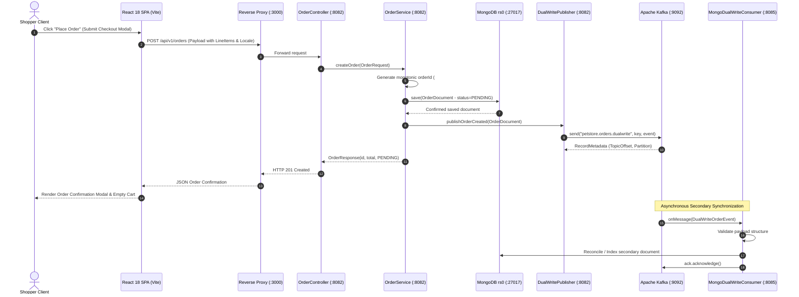

### 2.2 Admin Order Approval & Event Emission Sequence

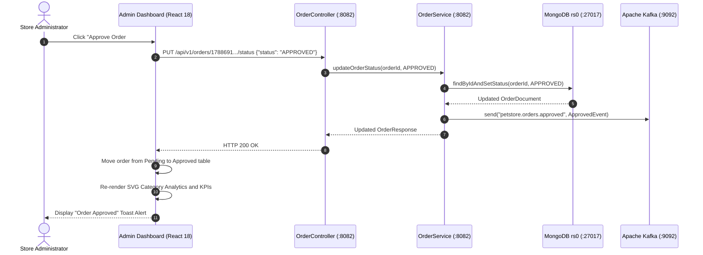

### 2.3 Supplier Inventory Adjustment & Immediate Reflection Sequence

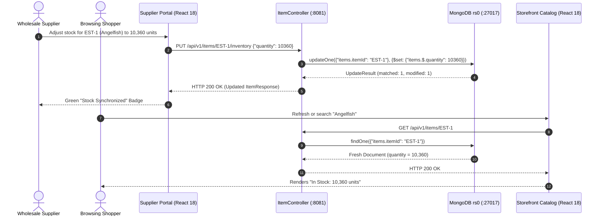

### 2.4 Chaos Outage, DLQ Isolation & Shadow Reconciliation Sequence

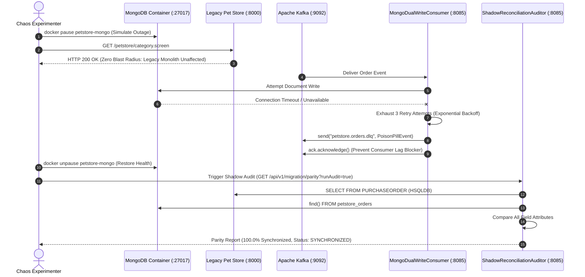

---

## 3. Document Schema & Entity-Relationship (ER) Diagrams

### 3.1 MongoDB Document Schemas

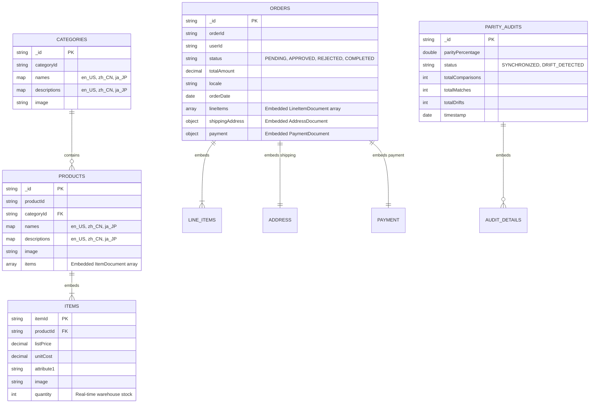

### 3.2 Schema Transformation: Relational 3NF vs. Modern Document Aggregates

| Legacy Relational Tables (12+ Tables) | Modern MongoDB Collections (3 Aggregates) | Modern Design Advantage |
| :--- | :--- | :--- |
| `CATEGORY` + `CATEGORY_DETAILS` | `categories` Collection | Multilingual map eliminates SQL JOINs across locale tables. |
| `PRODUCT` + `PRODUCT_DETAILS` + `ITEM` + `ITEM_DETAILS` + `INVENTORY` | `petstore_products` Collection (Embedded `items` array) | Single atomic query fetches product with all SKU items and stock. |
| `PURCHASEORDER` + `LINEITEM` + `CONTACTINFO` + `ADDRESS` + `CREDITCARD` | `petstore_orders` Collection (Embedded `lineItems`, `shipping`, `payment`) | Entire order tree persisted and retrieved in one atomic BSON read/write. |

---

## 4. State Machine Diagrams

### 4.1 Modern Order Lifecycle State Machine

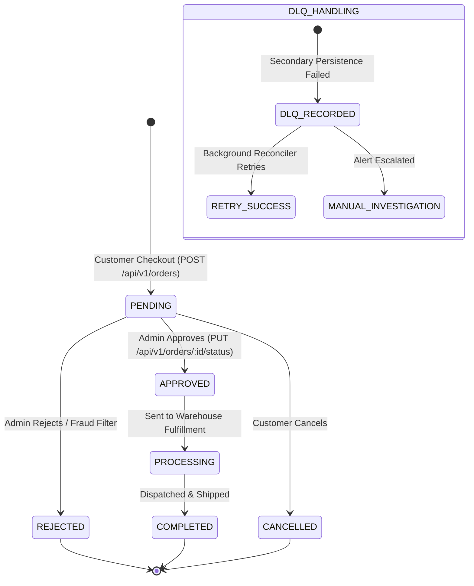

### 4.2 Supplier Inventory Stock Level State Machine

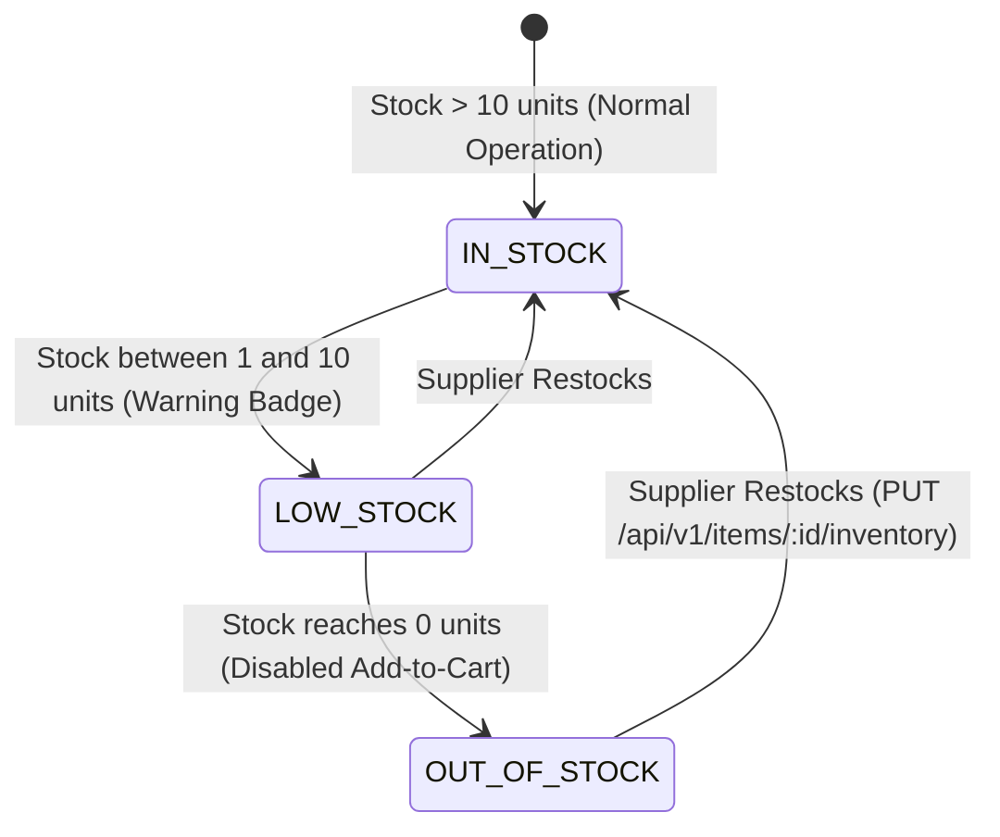

### 4.3 Shadow Reconciliation Parity State Machine

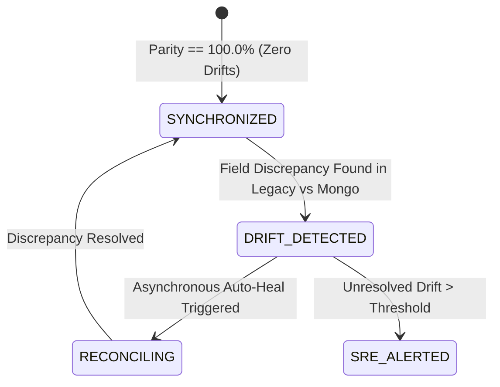

---

## 5. Algorithmic Flowcharts & Logic

### 5.1 Asynchronous Dual-Write & Non-Blocking Resilience Pipeline

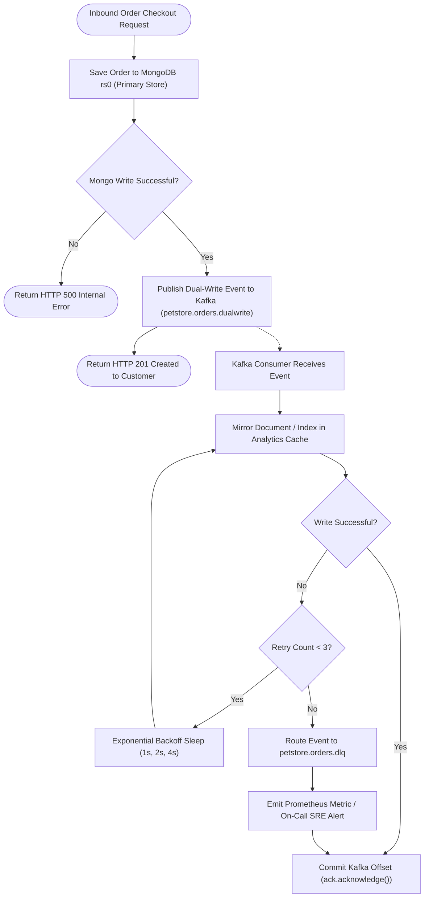

### 5.2 Multilingual Cart Language Preservation Algorithm

Ensures that when a shopper changes the storefront language, items previously added to the cart preserve the exact localized name and attributes from the time of addition:

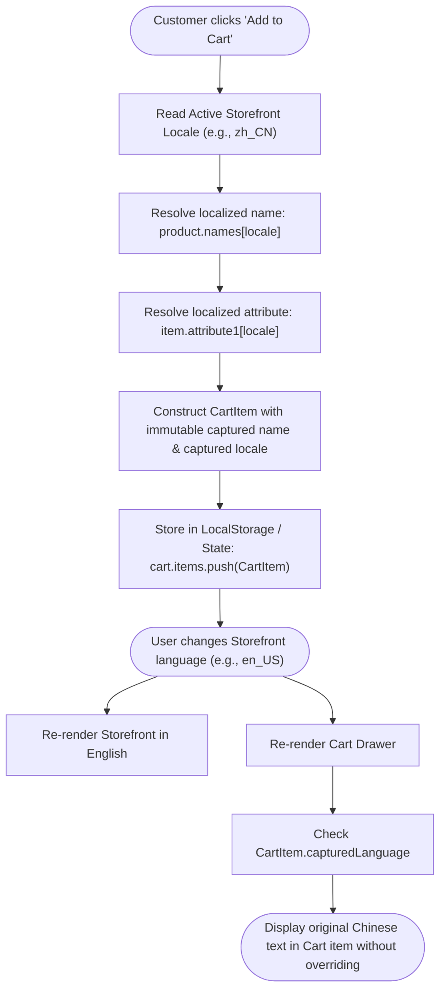
